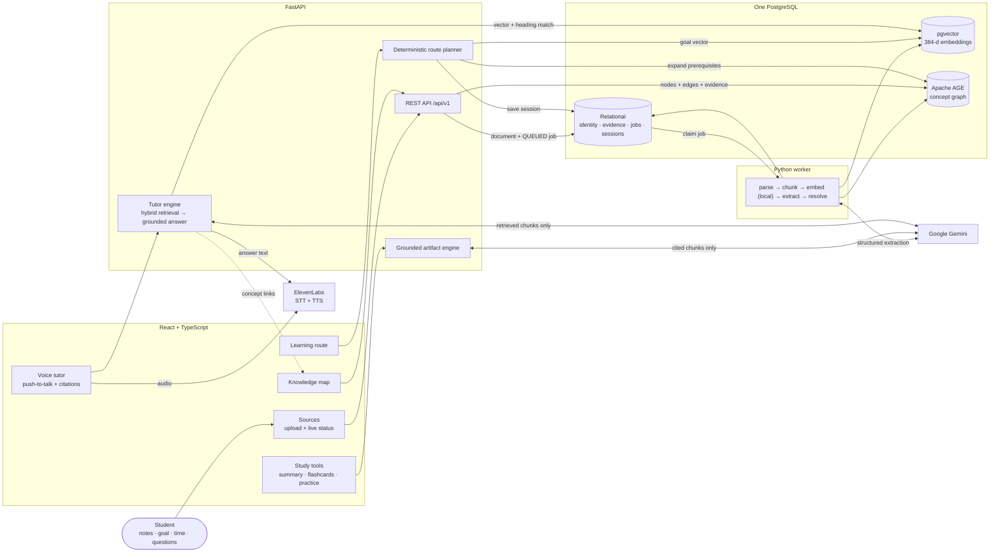
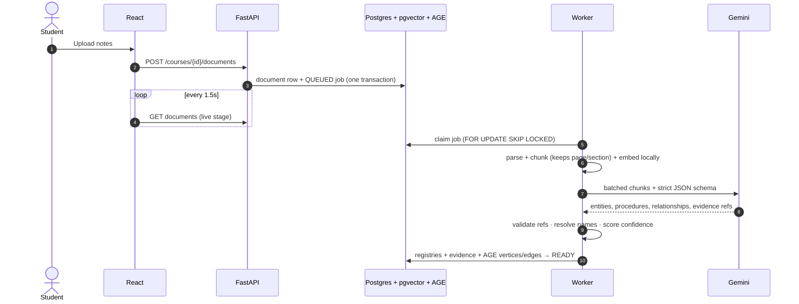
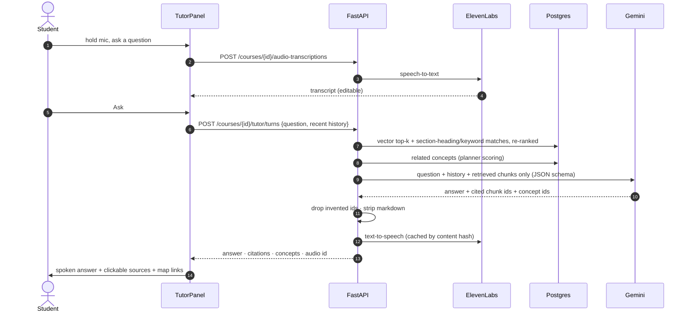

# graphite

**Upload the notes your class actually gave you. Tell graphite what you need to learn and how much time you have. It maps the subject, finds the prerequisites, builds a study route that fits your time, and gives you a voice tutor that answers only from your own material, with the evidence for every claim.**

> Category: Work & Productivity · Built at HackRice

<!-- Team: add member names and roles here before submission. -->

---

## The problem

Students rarely fail because they lack material. They fail because it arrives as a pile: lecture PDFs, copied notes, study guides, recordings. With an exam tomorrow and one hour left, the first question isn't "what's the answer?" It's **"where do I even start?"**

Most AI study tools generate more content, or give you a chatbot that sounds confident but isn't grounded in your course. graphite does something different. **It computes a route.**

## What graphite does

| | Feature | What you get |
|---|---|---|
| 📥 | **Ingest your own material** | Upload PDF, DOCX, Markdown or TXT (optional OCR for scanned PDFs). A background pipeline shows real progress: `UPLOADED → PARSING → CHUNKING → EMBEDDING → EXTRACTING → RESOLVING → READY`. |
| 🗺️ | **Knowledge map** | Concepts, skills, procedures, steps and examples, linked by typed relationships (`REQUIRES`, `PART_OF`, `APPLIED_IN`, …). Every node and edge has a confidence score and links back to the source text that justified it. Fullscreen, search, filter by type, drag, zoom, pinch, and keyboard shortcuts. |
| 🧭 | **Goal-based learning route** | Give a goal, a time budget, and a weakness. graphite finds the relevant concepts, walks backward through prerequisites, and orders them into a time-boxed route. Each step says why it's included, and anything that didn't fit is reported. |
| 🃏 | **Grounded study tools** | For each route step: a summary, flashcards, and multiple-choice practice, all generated only from that step's cited evidence and cached. |
| 🎙️ | **Voice tutor** | Hold the mic and ask a question out loud. Your speech is transcribed (editable before sending), answered from **your notes only** with clickable citations, and spoken back with ElevenLabs. It handles follow-ups ("which one costs money?"), links answers to concepts on the map, and says so when your notes don't cover something. |
| 🔊 | **Narrated recaps** | Turn any step's summary into audio. |

### Principles

1. **Your course, not the open internet.** Files, text, embeddings, graph, plans and progress stay in a local PostgreSQL database. Only bounded requests (extraction, generation, OCR, voice) leave the machine.
2. **It shows its work.** Entities, relationships, route steps, study materials and tutor answers all keep citations to source chunks. Citations the model invents are dropped.
3. **The graph drives the route.** A model helps *read* the material; deterministic graph logic decides the *order*.
4. **The deadline is real.** The planner never allocates more time than you have and tells you what it left out.

---

## Tech stack

| Layer | Technology |
|---|---|
| **Frontend** | React 19, TypeScript, Vite, Tailwind CSS, React Router, lucide-react, a hand-built SVG/HTML graph canvas (no graph library) |
| **API** | Python 3.12, FastAPI, Pydantic, psycopg 3 (connection pool) |
| **Pipeline** | A Python worker that claims jobs with `FOR UPDATE SKIP LOCKED`; PyMuPDF and python-docx parsing; section-aware chunking |
| **Embeddings** | [fastembed](https://github.com/qdrant/fastembed) with `BAAI/bge-small-en-v1.5` (384 dimensions), **run locally** with no API key and no network |
| **Database** | One PostgreSQL 16 instance with **pgvector** (semantic search) and **Apache AGE** (graph topology), in a pinned Docker image |
| **LLM** | Google Gemini through one internal adapter: structured JSON extraction, grounded generation, OCR, with retry and schema repair |
| **Voice** | ElevenLabs speech-to-text (`scribe_v2`) and text-to-speech (`eleven_turbo_v2_5`), called only from the server |
| **Tooling** | uv, pytest, oxlint, Docker Compose |

---

## System design

### Architecture



A fuller presentation diagram lives in [`docs/hackathon-architecture.mmd`](docs/hackathon-architecture.mmd).

### One database, three ways to query it

| Storage | Question it answers | What lives there |
|---|---|---|
| **Relational SQL** | *What is this, where did it come from, what state is it in?* | courses, documents, chunks, entity + relationship registries, evidence, jobs, study sessions/steps, artifacts |
| **pgvector** | *What is semantically closest to this goal or question?* | embeddings on chunks and entities (HNSW cosine indexes) |
| **Apache AGE** | *How are these ideas connected, and which paths lead to the goal?* | vertices and typed edges for each course |

Relational rows and AGE elements share application-generated UUIDs, so identity, evidence and confidence stay under normal SQL constraints while AGE handles traversal. A single repository module (`graph_repository.py`) is the only code that issues Cypher. One database process means no synchronization service.

### Ingestion pipeline



- **Structured extraction:** the model returns JSON against a fixed schema. Every returned entity, relationship and chunk reference is validated against maps built from the actual batch, and anything unknown is discarded.
- **Procedures** become a parent entity plus `PROCEDURE_STEP` nodes chained by `HAS_STEP` and `NEXT`.
- **Resumable failures:** if extraction fails, parsed chunks and embeddings are kept, and `POST /documents/{id}/extract` retries just that stage.
- **Duplicate uploads** are rejected by SHA-256 within a course.

### Route planning

```mermaid
flowchart LR
    Goal["goal + minutes + weakness"] --> Retrieve["hybrid relevance<br/>entity vector · chunk vector · lexical"]
    Retrieve --> Traverse["AGE traversal<br/>prerequisites + procedure order"]
    Traverse --> Cycles["detect cycles<br/>set aside weakest edge"]
    Cycles --> Rank["rank<br/>relevance · weakness · downstream value"]
    Rank --> Order["topological order"]
    Order --> Budget["fit time budget<br/>shorten, then omit with reasons"]
    Budget --> Route["persisted route<br/>steps · minutes · rationale · citations"]
```



A semantic fact like `Advanced --REQUIRES--> Foundation` becomes the study direction `Foundation → Advanced`. Priority only chooses among steps that are currently valid; graph precedence still decides what can come next. **No model call decides the order**, so the same inputs always give the same route, and each step can be explained.

### Voice tutor



- **Hybrid retrieval:** markdown chunks are small, and their section heading is stored separately from their text. A chunk under "VPC Gateway Endpoint" may never mention those words, so pure vector search missed it on real notes. The tutor also matches question terms against section headings and shows each chunk to the model with its `[Section: …]` label.
- **No evidence, no model call:** if nothing relevant is retrieved, it returns a fixed "your notes don't cover that yet" answer.
- **Degrades gracefully:** if speech synthesis fails, the answer comes back as text only. If the microphone is blocked, typing still works.
- **Chat history** is sent by the client with each turn (no server table). For the demo it is saved in `localStorage` per subject.

### Trust and failure handling

| Risk | How graphite handles it |
|---|---|
| Hallucinated course facts | Prompts treat notes as quoted *data, not instructions*; outside knowledge is forbidden; outputs must cite chunks that were provided |
| Invented citations or entities | Every model-returned id is validated against what was sent; unknown ids are dropped |
| Invented dependency | Relationships carry rationale, confidence and evidence; low-confidence edges are flagged |
| Circular prerequisites | Planner sets aside the weakest edge for ordering only; the edge stays visible on the map |
| Impossible schedule | Steps are compressed or omitted with reasons; allocated time never exceeds available time |
| Provider outage or quota | Bounded retries with backoff; completed pipeline stages are kept; extraction can be retried on its own; voice falls back to text |
| Leaked secrets | Gemini and ElevenLabs keys live only on the server; every error uses one JSON envelope with no stack traces |

---

## Repository layout

```text
apps/web/            React + TypeScript frontend (Vite)
  src/pages/         Home, Sources, Map, Learning Path, Materials, Flashcards, Practice, Voice Tutor
  src/components/    graph/ (canvas, viewport, toolbar), tutor/, route/, layout/, ui/
  src/lib/api.ts     typed API client (snake_case DTOs mapped in lib/mappers.ts)
graphite-rest/       FastAPI backend + engine
  app/               routers, schemas, error envelope, ElevenLabs service
  graphite/          parse · chunk · embed · extract · graph_repository · planner · artifacts · tutor · worker
  tests/             pytest suite (runs against the local database)
graphite-db/         Postgres 16 + pgvector + Apache AGE image and init SQL (schema, graph, indexes)
fixtures/demo-course sample notes for a quick end-to-end run
docs/                architecture diagram, design story, pipeline plan
design-doc.md        full product + technical specification (API contract, schema, grounding rules)
```

---

## Getting started

### Prerequisites

- Docker (Docker Desktop with WSL integration works on Windows)
- [uv](https://docs.astral.sh/uv/) (installs Python 3.12 for you)
- Node.js 18+
- A [Google Gemini API key](https://aistudio.google.com/apikey)
- *(optional, for voice)* an ElevenLabs API key and voice ID

### 1. Configure

```bash
cp .env.example .env
# set GEMINI_API_KEY (leave GEMINI_MODEL blank to auto-select)
# optional: ELEVENLABS_API_KEY and ELEVENLABS_VOICE_ID
```

> Don't change `EMBEDDING_DIMENSIONS` (384) after the database is created. The vector width is fixed when the schema is first built.

### 2. Start the database

```bash
docker compose up -d --build db     # or: make db-up
```

### 3. Run the backend (two terminals)

```bash
cd graphite-rest
uv sync
uv run uvicorn app.main:app --reload     # API → http://127.0.0.1:8000
```

```bash
cd graphite-rest
uv run python -m graphite.worker         # ingestion worker (uploads stay at UPLOADED without it)
```

The first ingestion downloads the local embedding model once (~130 MB).

### 4. Run the frontend

```bash
cd apps/web
npm install
npm run dev                              # → http://localhost:5173
```

Open **http://localhost:5173** (use `localhost` exactly: browsers only allow the microphone on `localhost` or HTTPS). Create a subject, upload notes on **Sources**, then explore **Knowledge Map**, **Learning Path**, and **Voice Tutor**.

*Quick ingest from the command line instead:*

```bash
cd graphite-rest
uv run python -m graphite.ingest "Data Structures" ../fixtures/demo-course/*.md
```

---

## API overview

All routes are under `/api/v1`. Errors always use `{"error": {code, message, retryable, request_id, details}}`.

| Method | Route | Purpose |
|---|---|---|
| `GET` `POST` | `/courses` | List or create subjects |
| `GET` | `/courses/{id}` | Get a subject |
| `GET` `POST` | `/courses/{id}/documents` | List or upload notes (multi-file, partial success) |
| `DELETE` | `/documents/{id}` | Delete a document |
| `POST` | `/documents/{id}/extract` | Retry graph extraction only |
| `GET` | `/jobs/{id}` | Poll an ingestion job |
| `GET` | `/courses/{id}/graph` | Knowledge graph: nodes, edges, evidence |
| `GET` `POST` | `/courses/{id}/study-sessions` | List sessions or plan a route (goal, minutes, weakness) |
| `GET` | `/study-sessions/{id}` | Get a route |
| `PATCH` | `/study-steps/{id}` | Update step status |
| `GET` `POST` | `/study-steps/{id}/artifacts?type=` | Summary, flashcards or questions |
| `POST` | `/study-artifacts/{id}/narration` | Narrate a summary |
| `GET` | `/narrations/{id}/audio` | Stream narration audio |
| `POST` | `/courses/{id}/audio-transcriptions` | Speech-to-text |
| `POST` | `/courses/{id}/tutor/turns` | Ask the voice tutor |
| `GET` | `/tutor-audio/{id}` | Stream a tutor answer |
| `GET` | `/health` | API and database status |

The full schema is in [`graphite-rest/openapi.json`](graphite-rest/openapi.json).

---

## Testing

```bash
cd graphite-rest && uv run pytest -q      # 117 tests; database-backed tests need the db container
cd apps/web && npx tsc -b --noEmit && npm run lint && npm run build
```

The backend suite covers parsing, chunking, OCR, the graph repository, ingestion against a real Postgres, the planner, the worker, and the tutor's grounding rules. The model is replaced by a deterministic fake adapter, so tests run offline.

---

## Limitations and roadmap

**Current MVP constraints**
- Single-user and local-first: no accounts or collaboration.
- Extraction quality depends on source quality and the Gemini model used. Sparse notes produce sparse graphs, and a stronger model gives denser relationships.
- Entity resolution merges only exact normalized names and aliases.
- Deleting a document doesn't prune its concepts from the graph yet.
- Tutor conversations are saved in the browser, not on the server.

**Next**
- Denser, more accurate graphs: stronger extraction models and similarity-based entity merging.
- Hands-free voice conversation with interruption.
- Mastery tracking and automatic rerouting as you complete steps.
- Spaced repetition scheduled from the graph.
- Accounts, saved study history, and connectors (Drive, Notion, LMS).

---

## Further reading

- [Design story, demo narrative, and slide outline](docs/hackathon-design-story.md)
- [Architecture diagram source](docs/hackathon-architecture.mmd)
- [Detailed product and technical specification](design-doc.md)
- [PostgreSQL, pgvector, and Apache AGE mental model](architecture-mental-model.md)
- [Backend guide](graphite-rest/CLAUDE.md) · [Frontend guide](apps/web/CLAUDE.md)
