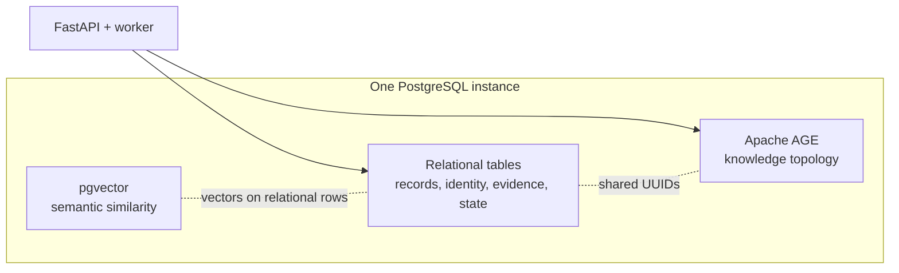
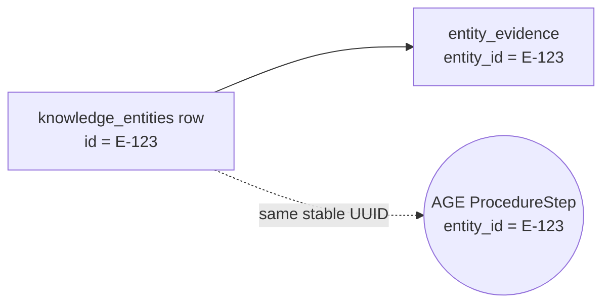
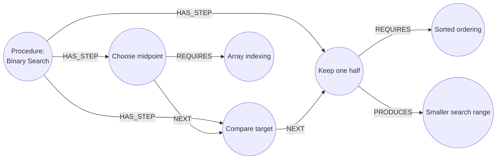
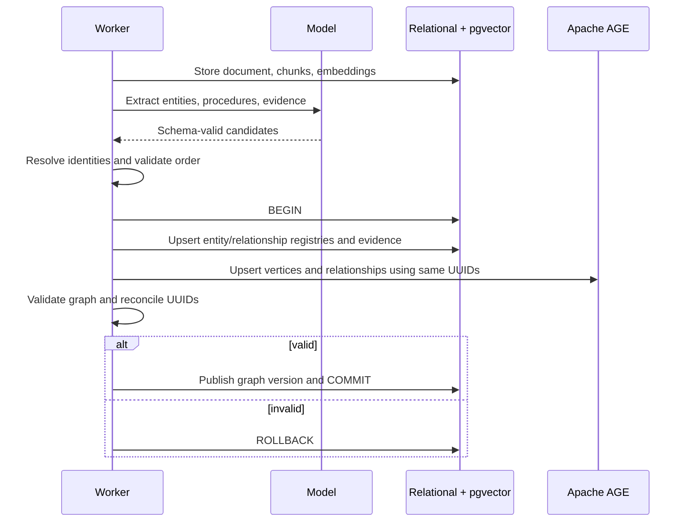
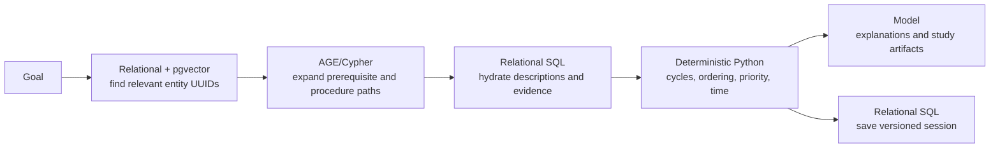

# graphite architecture mental model

> **Purpose:** Human-review companion to `design-doc.md`. This document explains the proposed storage and execution model without acting as a second source of product requirements.
>
> **Review status:** Proposed hybrid architecture: one PostgreSQL instance containing ordinary relational tables, pgvector, and an Apache AGE property graph.

## 1. The shortest useful mental model

graphite has one local database process with three ways of organizing data:



Think of their jobs this way:

- Relational tables answer: **What is this item, where did it come from, and what application state belongs to it?**
- pgvector answers: **Which stored items are semantically similar to this goal or chunk?**
- AGE answers: **How are these knowledge items connected, and what paths exist between them?**
- Python planning code answers: **Given those paths, what should the student do next under the product's rules?**

The graph is the product's canonical topology, but it is not the canonical home for every field.

## 2. What is purely relational

Ordinary PostgreSQL tables remain the durable application backbone:

| Area | Example tables | Why relational |
| --- | --- | --- |
| Course/source management | `courses`, `documents`, `chunks` | Strong ownership, cascading deletes, uniqueness, and source locations |
| Searchable entity records | `knowledge_entities` | Stable UUIDs, names, descriptions, aliases, type, identity scope, confidence, and embeddings |
| Relationship records | `graph_relationships` | Stable relationship UUID, confidence, rationale, review status, and graph version |
| Provenance | `entity_evidence`, `relationship_evidence` | Direct foreign keys to source chunks and inspectable citations |
| Operations | `jobs` | Transactions, retries, row locks, and worker recovery |
| User outcomes | `study_sessions`, `study_steps`, `study_artifacts` | Versioned plans, progress, generated content, and historical snapshots |

These tables are “pure relational” in the sense that the API can manage them with normal SQL, constraints, migrations, and transactions. They do not need Cypher.

The `embedding` columns on `chunks` and `knowledge_entities` use pgvector, but those rows are still ordinary relational records.

For the MVP, a `ProcedureStep` is identity-scoped to its parent procedure through `knowledge_entities.identity_scope_id`. That prevents generic names such as “Check the result” from merging across unrelated procedures. The field scopes identity; `HAS_STEP` remains the canonical membership relationship.

## 3. What lives in Apache AGE

AGE stores graph vertices and relationships.

### Vertex types

```text
Concept
Skill
Formula
Procedure
ProcedureStep
Example
```

Every AGE vertex carries at least:

```json
{
  "entity_id": "application-uuid",
  "course_id": "course-uuid",
  "name": "display name"
}
```

The complete description, vector, aliases, confidence, and evidence do not need to be copied into AGE. They remain in `knowledge_entities`.

### Relationship types

```text
REQUIRES
DERIVED_FROM
PART_OF
EXAMPLE_OF
CONTRASTS_WITH
APPLIED_IN
RELATED_TO
HAS_STEP
NEXT
PRODUCES
```

Every AGE relationship carries at least:

```json
{
  "relationship_id": "application-uuid",
  "course_id": "course-uuid",
  "status": "ACTIVE",
  "confidence": 0.91,
  "graph_version": "version-id"
}
```

Confidence, rationale, status, graph version, and evidence remain canonical in `graph_relationships` and `relationship_evidence`. The query-critical values shown above are copied to AGE so Cypher can exclude suppressed/review or stale relationships before traversing them. Reconciliation verifies that the copies match the relational registry.

### Why AGE does not own all fields

Evidence needs reliable references to document chunks. Jobs and study sessions need ordinary transactional behavior and clear schemas. Vectors need pgvector indexes. Putting all of that into vertex properties would weaken constraints, complicate migrations, and make routine application queries harder.

AGE is therefore responsible for topology, not for becoming a replacement for PostgreSQL's relational model.

## 4. The shared-UUID bridge

PostgreSQL cannot create a normal foreign key from a relational UUID column to an AGE vertex property. graphite bridges the models with application-generated UUIDs:



Rules:

1. Generate the UUID before either write.
2. Write the relational row and AGE vertex/relationship in the same PostgreSQL transaction.
3. Ensure the AGE label/type and the corresponding relational registry type agree.
4. Roll back both if either write fails.
5. Never use AGE's internal `graphid` outside the graph repository.
6. Run a reconciliation check after rebuilds and before marking a graph version ready.

This does not produce a database-enforced foreign key into AGE. It produces an application-enforced invariant backed by atomic writes and reconciliation.

## 5. How procedural knowledge is represented

A procedure is not one node containing an opaque array of step strings. The procedure and each meaningful step are separate entities:



This provides two independent facts:

- `HAS_STEP` says which steps belong to the procedure.
- `NEXT` says how supported steps are ordered.

Keeping both is intentional. If one ordering relationship is uncertain or suppressed, graphite can still show all known members of the procedure.

### When something should be a step node

Create a `ProcedureStep` when it can be cited, explained, practiced, depended on, completed, or misunderstood independently. Keep minor wording inside the step description when it has no independent instructional value.

### Branching procedures

A real source may describe conditions:

```text
Compare target
├── target is smaller → keep left half
└── target is larger  → keep right half
```

Do not flatten this into a false sequence. A branch should have source evidence and an explicit condition property/rationale. If the MVP UI cannot explain branches safely, mark the procedure incomplete or review-required rather than inventing a linear order.

## 6. Ingestion/write flow



The application should coordinate this through one `GraphRepository`. Model code should return typed candidates; it should not issue SQL or Cypher directly.

## 7. Goal/read flow

The route is produced in stages rather than by one database query or one model prompt:



The boundary matters:

- pgvector discovers plausible starting points.
- AGE expands connections and returns a bounded subgraph.
- SQL attaches trusted metadata and citations.
- Python applies product policy, including cycle suppression and time allocation.
- The model explains the already-validated route and generates grounded material.

Cypher should not silently decide the final study order merely because it can return a path.

## 8. Example end-to-end lookup

Suppose the goal is “Learn enough to perform binary search.”

1. pgvector and lexical search identify the UUID for `Binary Search`.
2. AGE expands its `REQUIRES`, `HAS_STEP`, and `NEXT` neighborhood.
3. AGE returns UUIDs for the procedure, its steps, `Array indexing`, and `Sorted ordering`.
4. SQL hydrates those UUIDs with descriptions, confidence, and chunk citations.
5. Python reverses semantic `REQUIRES` direction for planning, preserves the `NEXT` chain, handles any cycle, and allocates minutes.
6. The saved study session references `knowledge_entities.id`, so it remains readable without leaking AGE internal IDs.

Possible route:

```text
1. Review sorted ordering
2. Review array indexing
3. Binary Search / Choose midpoint
4. Binary Search / Compare target
5. Binary Search / Keep one half
6. Practice the complete procedure
```

## 9. Failure and recovery model

| Failure | Expected behavior |
| --- | --- |
| Model extraction fails | Keep documents/chunks; mark the job retryable; publish no partial graph version |
| AGE write fails | Roll back relational registry/evidence writes from the same transaction |
| Relational write fails | Do not commit AGE topology |
| Reconciliation finds an orphan | Keep the new graph version unavailable; rebuild or repair through `GraphRepository` |
| Procedure order is unsupported | Preserve evidenced entities; mark relationships/procedure for review rather than inventing `NEXT` |
| AGE is unavailable at startup | Health check fails with a graph-specific reason; prepared relational source data remains intact |
| External model is unavailable during demo | Read and plan from the prepared local graph; use cached artifacts where available |

## 10. What this architecture buys us

- The stored topology matches the product's graph-first mental model.
- Cypher makes multi-hop prerequisite and procedural queries readable.
- Procedure steps can carry their own prerequisites, evidence, mastery, and study activity.
- Documents, citations, vectors, jobs, and sessions keep relational constraints and conventional tooling.
- The application still runs one local database process.
- Stable UUIDs keep API contracts independent of AGE storage internals.

The cost is additional schema coordination, connection initialization, extension packaging, and reconciliation testing. This architecture is worthwhile only if graph traversal and procedural structure remain central product behavior.

## 11. Human revision checklist

Resolve these questions before freezing migrations and contracts:

- Is one shared AGE graph with `course_id` filtering acceptable, or is per-course graph isolation worth the added dynamic-name complexity?
- Which exact PostgreSQL, pgvector, and AGE versions are pinned in the Docker image?
- Can the chosen AGE version enforce the desired property indexes, or must UUID uniqueness be repository-enforced?
- Are conditional/branching procedures P0, review-only, or out of scope?
- Should a later release allow one procedure step to belong to multiple procedures? The MVP assumes steps are parent-scoped.
- Does mastery attach to a reusable knowledge entity, to a course/entity pair, or only to a study-session step?
- Which duplicated AGE display properties are allowed, and which relational fields are strictly canonical?
- What is the maximum graph size and Cypher expansion depth tested for the demo?
- What exact reconciliation query blocks a graph version from becoming ready?

## 12. One-sentence architecture explanation

> graphite uses ordinary PostgreSQL tables for trustworthy records and evidence, pgvector to find relevant knowledge, Apache AGE to store and traverse how that knowledge is connected, and deterministic Python to turn the resulting subgraph into a safe study route.
