# graphite — Product Design and Technical Execution Document

> **Working title:** graphite  
> **One-line product definition:** graphite turns a student's scattered course materials into an evidence-backed knowledge graph and computes a goal-specific route through that graph.  
> **Hackathon track:** Work & Productivity  
> **Document status:** Build-ready MVP specification  
> **Primary audience:** Three-person hackathon engineering team, mentors, and judges  
> **Deployment posture:** Local-first application; only model-provider and ElevenLabs requests leave the machine

---

## 0. Executive decision summary

graphite is not a generic “chat with your notes” application. It is a local-first study-planning system that:

1. accepts course material as PDF, DOCX, TXT, or Markdown;
2. parses and stores the material locally;
3. generates embeddings and extracts canonical concepts, procedures, ordered procedure steps, typed relationships, and source evidence;
4. persists searchable metadata and evidence in relational PostgreSQL tables, vectors through pgvector, and canonical graph topology through Apache AGE in the same PostgreSQL instance;
5. accepts a concrete learning objective such as “I have two hours to study Units 1–3 and I struggle with recursion”;
6. retrieves a goal-relevant subgraph;
7. uses deterministic graph logic to order prerequisites and allocate time;
8. generates source-grounded summaries, flashcards, and practice questions for each path step; and
9. optionally delivers the path through a narrated study mode using ElevenLabs.

The product's memorable moment is not file upload, chatbot output, or graph animation by itself. It is the moment graphite explains:

> “Do not start with Trees. Your notes establish Recursion as a prerequisite, and your stated weakness makes it the highest-priority starting point.”

That moment directly answers the track's productivity requirement: graphite reduces the cognitive overhead of deciding **what to study, in what order, and from which source**.

### 0.1 Locked MVP decisions

| Decision | MVP choice | Reason |
| --- | --- | --- |
| Primary user | A student preparing for a near-term exam | Specific, relatable, and demoable |
| Primary job | Convert messy course material into a timed learning path | More differentiated than note chat |
| Frontend | React + TypeScript, preferably Vite | Fast local development and strong graph-library support |
| Backend | FastAPI + Python | Strong PDF/ML tooling and fast typed API construction |
| Database | Local PostgreSQL + pgvector + Apache AGE | One durable multi-model system for relational, vector, and graph data |
| Runtime | Docker Compose for PostgreSQL; frontend/backend run locally | Low setup friction and no cloud deployment dependency |
| Graph storage | AGE property graph plus relational entity/relationship registries | Cypher matches the product's graph mental model while stable UUID registries preserve evidence and application integrity |
| Graph rendering | React Flow | Interactive nodes, edges, layout, and click behavior |
| Model access | One external model provider for embeddings and LLM inference | Centralizes API configuration and cost controls |
| Voice | ElevenLabs through the backend only | Keeps the API key out of the browser |
| Supported files | PDF, DOCX, TXT, MD | Covers the demo without third-party connectors |
| Notion/Notability | Export to a supported file; no connector in MVP | Maintains the two-external-service constraint |
| Planning | Deterministic graph traversal plus bounded LLM assistance | Explainable and repeatable |
| Authentication | None for MVP | Single-user local application does not need auth |
| Collaboration | Out of scope | Not needed to prove the core learning workflow |

### 0.2 Non-negotiable product principles

1. **Evidence before confidence.** Every displayed knowledge entity and meaningful relationship must link to one or more source chunks.
2. **Graph before generation.** Learning order must use graph structure; it cannot be a single unconstrained model response.
3. **Procedures are graph structure.** A procedure and each meaningful step are separate graph entities; order and dependencies are explicit relationships, not opaque text embedded in one node.
4. **Goal-specific output.** The full graph is persistent, but every study path is a scoped subgraph created for a specific objective.
5. **Local by default.** Files, extracted text, embeddings, graph entities, plans, and progress stay in local PostgreSQL. Only required prompt payloads leave the machine.
6. **Visible uncertainty.** Low-confidence or weakly supported relationships are visually distinguishable and never silently treated as fact.
7. **Progressive value.** A partial ingestion should still produce something inspectable. Voice and polished artifacts must not block the graph and path.
8. **No dead-end screens.** Every application state must tell the user what happened, what is happening, or what action is available next.

---

## 1. Product framing

### 1.1 User problem

Students rarely lack study content. They lack a reliable way to turn scattered content into an executable plan. Before an exam, the student may have lecture PDFs, exported handwritten notes, study guides, and incomplete personal notes. The cognitive burden is not merely understanding the material. It is also:

- locating the relevant content;
- identifying which ideas matter for the stated exam scope;
- resolving duplicate terms across sources;
- determining prerequisite order;
- estimating what fits into the available time;
- deciding whether to review, practice, or skip each topic; and
- trusting that generated guidance is grounded in the actual course.

Generic note-chat products reduce search cost but still require the user to decide what to ask and how to organize the answer. Generic study-guide generators produce useful prose but usually hide their reasoning, flatten dependencies, and cannot visibly reroute as the student's goal changes.

graphite addresses the upstream planning problem: it models the course, narrows that model to the user's objective, and converts it into an ordered route.

### 1.2 Product thesis

If graphite can infer a sufficiently accurate, evidence-backed concept graph from the student's own material, then deterministic graph operations can reduce a broad study request into an explainable sequence. Model inference supplies semantic interpretation; graph algorithms supply stable structure; citations supply trust.

### 1.3 Value proposition

> Upload what your class actually gave you. Tell graphite the destination and available time. graphite maps the concepts, finds the prerequisites, and builds the shortest sensible route—while showing the evidence behind every step.

### 1.4 Why this is not “RAG plus flashcards”

| Commodity behavior | graphite behavior |
| --- | --- |
| Retrieve chunks and answer a question | Build a persistent course model and retrieve a relevant subgraph |
| Ask the model to make a study plan | Compute prerequisite order, then ask the model to explain and enrich it |
| Show generated statements without provenance | Attach sources to concepts, edges, summaries, and questions |
| Regenerate an unrelated plan on every prompt | Preserve graph state and create versioned goal-specific sessions |
| Treat a graph as decoration | Use graph edges directly in traversal, ordering, and rerouting |
| Add voice as a read-aloud button | Use narration as an optional delivery mode for an already structured path |

### 1.5 “Google Maps for learning” mental model

| Navigation concept | graphite equivalent |
| --- | --- |
| Map | Persistent course knowledge graph |
| Destination | User's exam or learning objective |
| Current location | User-stated weakness or diagnostic mastery state |
| Road dependency | `REQUIRES` concept edge |
| Route | Ordered learning path |
| Route explanation | Edge evidence and source citations |
| Traffic/constraint | Limited study time |
| Rerouting | Recompute after a quiz, time change, or changed objective |

---

## 2. Users, jobs, and scenarios

### 2.1 Primary persona

**Deadline-driven student**

- Has an exam within hours or days.
- Has multiple instructor-provided and self-created sources.
- Does not want to manually tag or organize those sources.
- Can state scope, available time, and weaknesses in plain language.
- Needs confidence that the plan reflects the class rather than generic internet material.

### 2.2 Primary job to be done

> When I have limited time before an exam and my material is spread across multiple files, help me determine what to study first, what can be skipped, and why, so I can begin useful work immediately instead of planning how to study.

### 2.3 Core scenario

1. The student creates a local course workspace.
2. The student uploads lecture PDFs and exported notes.
3. graphite shows document-level ingestion progress.
4. graphite renders the extracted full-course graph.
5. The student enters: “Exam tomorrow, Units 1–3, two hours, weak on recursion.”
6. graphite identifies relevant target entities and walks backward through prerequisite and procedure-order relationships.
7. graphite removes irrelevant graph branches, orders prerequisites, and fits the route to 120 minutes.
8. The student sees a path with time boxes and reasons for inclusion.
9. The student opens a path step and sees a source-backed summary, flashcards, practice questions, and cited source excerpts.
10. The student optionally starts narrated study mode.

### 2.4 Secondary scenarios

- “Teach me only enough calculus to understand gradient descent.”
- “Review chapters 4–7 in 45 minutes.”
- “Generate a conceptual path instead of a memorization-heavy one.”
- “I now have 30 minutes; reroute the existing plan.”
- “Explain why this node comes before that one.”

### 2.5 Explicit non-users for the MVP

- institutions needing multi-tenant administration;
- instructors authoring official curriculum;
- teams collaboratively editing the same graph;
- users expecting internet research or fact-checking outside their files;
- users requiring handwriting recognition from raw image files; and
- users requiring live Notion, Notability, Drive, LMS, or calendar synchronization.

---

## 3. Scope

### 3.1 P0: Must work during the judged demo

- Create/select one local course.
- Upload at least PDF and Markdown/TXT; DOCX should work unless it threatens PDF reliability.
- Parse, chunk, embed, and persist source content.
- Extract concepts, procedures, procedure steps, and a controlled set of typed relationships.
- Attach source evidence to every displayable entity and relationship.
- Render a usable graph with click-to-inspect evidence.
- Accept a study goal containing scope and available time.
- Produce a relevant subgraph and an ordered learning path.
- Show why each step was included and which source supports it.
- Generate at least one source-grounded study artifact type; target all three: summary, flashcards, questions.
- Survive invalid files, empty retrieval, malformed model output, and page refresh without losing completed work.

### 3.2 P1: Strong differentiators if P0 is stable

- Narrate a path step through ElevenLabs.
- Provide a three-question diagnostic.
- Store a simple mastery score per knowledge entity.
- Recompute the route after the diagnostic.
- Compare the full course graph with the selected goal subgraph.
- Stream visible ingestion stage changes.

### 3.3 P2: Only after the demo is frozen

- Voice input/transcription.
- Rich course management.
- Manual concept merge/split.
- Editable edge types.
- Multiple saved plan versions.
- Export flashcards or plan.
- Local model fallback.

### 3.4 Explicitly out of scope

- Notion OAuth or Notability integration;
- Google Drive or LMS connectors;
- external web search;
- internet-derived content enrichment;
- cloud hosting or managed database;
- user accounts, permissions, or social collaboration;
- real-time multi-user editing;
- custom graph database;
- training or fine-tuning models;
- arbitrary media ingestion;
- perfect formal curriculum inference; and
- autonomous grading with academic authority.

### 3.5 Scope kill order

If time becomes constrained, remove features in this order:

1. voice input;
2. mastery rerouting;
3. ElevenLabs narration;
4. DOCX support;
5. multiple artifact formats;
6. visual polish beyond a coherent demo theme;
7. graph editing.

Never cut:

- source evidence;
- the graph-to-path transformation;
- reliable PDF or text ingestion;
- the time-bounded objective;
- path explanation; or
- a deterministic ordering component.

---

## 4. Success criteria

### 4.1 Product success

The demo succeeds when a judge can answer all five questions without explanation from the team:

1. What problem does graphite solve?
2. Why is this better than uploading notes to a chatbot?
3. Why is the recommended order trustworthy?
4. Where did a graph relationship come from?
5. What changes when the user's goal or available time changes?

### 4.2 Functional acceptance criteria

| ID | Criterion | Pass condition |
| --- | --- | --- |
| F-01 | Upload | A supported file produces a durable document record |
| F-02 | Parse | Extracted text is non-empty and source location metadata is retained |
| F-03 | Embed | Every retained chunk has one embedding of the configured dimension |
| F-04 | Extract | The pipeline produces canonical entities, ordered procedures, and controlled relationship types |
| F-05 | Evidence | Every displayed entity and relationship has evidence or is explicitly labeled unsupported/review |
| F-06 | Graph | Refreshing the page reconstructs the graph from PostgreSQL |
| F-07 | Goal | A user can provide objective, scope, available minutes, and weakness text |
| F-08 | Subgraph | The returned graph excludes clearly unrelated entities |
| F-09 | Plan | Every plan step maps to a knowledge entity and has duration, reason, and citations |
| F-10 | Ordering | `REQUIRES` and procedure-local `NEXT` relationships are respected unless an explicit cycle fallback is shown |
| F-11 | Artifact | A selected step can generate grounded study material |
| F-12 | Failure | Model, parser, and voice errors are recoverable without restarting the app |

### 4.3 Demo-level quality targets

These are operational targets, not claims of scientific accuracy:

- First graph visible within 60–120 seconds for the prepared demo corpus.
- Goal-to-path response within 10–20 seconds after ingestion.
- At least 80% of visible concepts judged relevant by the team on the demo corpus.
- At least 80% of visible prerequisite edges judged plausible and evidence-supported by the team.
- Zero uncited path steps.
- Zero browser-exposed model or ElevenLabs secrets.
- One-command database startup and no required cloud infrastructure.

### 4.4 North-star interaction

The student submits a natural-language goal and receives an immediately actionable path whose first step is not merely relevant, but demonstrably necessary because of a cited prerequisite chain.

---

## 5. Experience design

### 5.1 Information architecture

The main application is a workspace, not a chat transcript.

- **Left panel — Sources:** uploaded documents, ingestion status, retry action, and source filters.
- **Center panel — Map:** full graph or goal subgraph, legend, zoom controls, and evidence inspection.
- **Right panel — Route:** ordered path, time budget, inclusion reason, and completion state.
- **Bottom composer — Objective:** natural-language goal plus structured time control.
- **Study drawer/page:** summary, citations, flashcards, practice questions, and narration.

### 5.2 Key screens

#### A. Empty course

- Product promise in one sentence.
- Large drag-and-drop area.
- Supported-file list.
- Example goal shown as inactive guidance.
- Privacy note: files remain local; selected excerpts are sent to the configured model provider for processing.

#### B. Ingestion in progress

- One row per document.
- Stable stages: `UPLOADED`, `PARSING`, `CHUNKING`, `EMBEDDING`, `EXTRACTING`, `RESOLVING`, `READY`, `FAILED`.
- Completed files remain usable while others process.
- No fake percentage unless the backend can calculate one. Prefer stage labels.

#### C. Course map

- Nodes colored by type or learning status, not decorative randomness.
- Edge styling by relation type.
- Low-confidence edges use reduced opacity or dashed strokes.
- Clicking a node opens description and sources.
- Clicking an edge opens relation type, confidence, and supporting excerpt.

#### D. Goal route

- Original goal remains visible.
- Show total allocated minutes and the user's budget.
- Each step includes its knowledge entity, duration, activity type, inclusion reason, prerequisite/order link, and source count.
- The selected subgraph is visually emphasized; unrelated full-graph nodes fade or disappear.

#### E. Study mode

- One concept, procedure, or procedure step at a time.
- Short explanation before optional details.
- Citations open the exact local source location when possible.
- Flashcards reveal on click.
- Practice questions allow self-check; avoid claiming authoritative grading.
- Narration is an explicit action and can be stopped.

### 5.3 Required loading, empty, and error states

| State | User-facing behavior |
| --- | --- |
| No files | Explain what to upload and why |
| File rejected | State format/size reason without clearing accepted files |
| Parse produces no text | Suggest an OCR-capable export; do not send empty content to the model |
| Ingestion active | Show current stage and permit navigation |
| Model unavailable | Preserve parsed chunks and expose retry |
| Graph empty | Show extracted source preview and retry extraction |
| Goal retrieves no targets | Ask the user to broaden scope or select source documents |
| Graph cycle | Show a best-effort route and label the cycle resolution |
| Voice unavailable | Keep text study mode fully functional |
| Page refresh | Restore all completed data and poll active jobs |

### 5.4 Accessibility

- Graph content must also exist as a list; the canvas cannot be the only representation.
- Color is never the sole signal for relation type, confidence, or mastery.
- All primary actions are keyboard accessible.
- Narration always has visible playback controls and equivalent text.
- Animations respect reduced-motion preference.
- Evidence excerpts use readable line length and sufficient contrast.

---

## 6. System architecture

See `architecture-mental-model.md` for the human-review explanation of the relational, pgvector, AGE, UUID-bridge, read-flow, and write-flow boundaries. This document remains authoritative for product scope and implementation requirements.

### 6.1 Context diagram

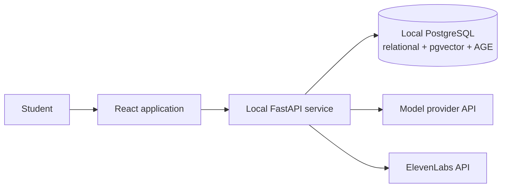

Only the last two calls cross the local machine boundary. The browser communicates exclusively with the local backend.

### 6.2 Component architecture

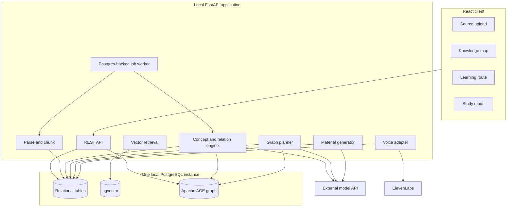

### 6.3 Processing lifecycle

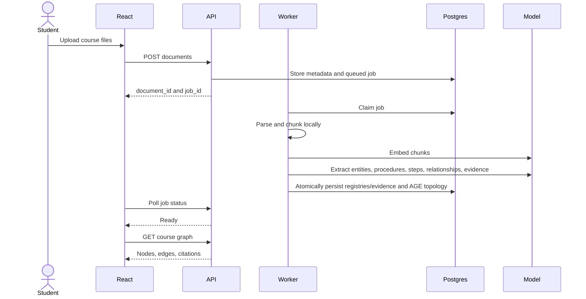

### 6.4 Goal-to-route lifecycle

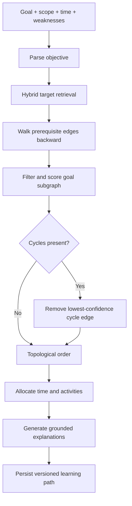

### 6.5 Local runtime topology

Recommended repository layout:

```text
graphite/
├── apps/
│   ├── web/                  # React + TypeScript
│   └── api/                  # FastAPI HTTP application
├── services/
│   └── intelligence/         # Model, extraction, graph, planning modules
├── packages/
│   └── contracts/            # OpenAPI snapshot, JSON Schema, shared fixtures
├── database/
│   ├── migrations/
│   └── seeds/
├── fixtures/
│   ├── demo-course/
│   └── api-responses/
├── scripts/
├── docker-compose.yml
├── .env.example
├── Makefile
└── README.md
```

Recommended local processes:

| Process | Command concept | Responsibility |
| --- | --- | --- |
| PostgreSQL | `docker compose up db` | Durable relational data, pgvector indexes, AGE topology, and jobs |
| API | `uvicorn ... --reload` | HTTP endpoints and provider adapters |
| Worker | Separate Python process | Claims durable jobs and runs ingestion |
| Web | `npm run dev` | React UI |

The API and worker may share the same codebase. Keeping them as separate processes prevents long model calls from blocking HTTP requests and creates visible, restartable job state without adding Redis, Kafka, or a cloud queue.

### 6.6 Dependency policy

- PostgreSQL is the only infrastructure process.
- pgvector and Apache AGE are enabled as PostgreSQL extensions in one pinned Docker image.
- Every API and worker connection initializes AGE (`LOAD 'age'` and the required search path) through the connection-pool hook.
- Graph and relational registry writes occur in the same database transaction.
- The model provider is accessed through one internal adapter.
- ElevenLabs is accessed through one internal adapter.
- No browser-to-provider calls are allowed.
- No third-party analytics, auth, object storage, queues, or content connectors are allowed in the MVP.
- Uploaded files may live in a local `data/uploads` directory; metadata and derived content live in PostgreSQL.
- The demo must work after restarting the API and React processes, assuming PostgreSQL and the local upload directory remain intact.

---

## 7. Data architecture

### 7.1 Entity relationship model

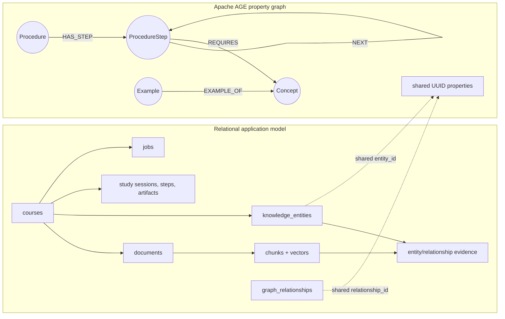

AGE owns graph topology: which entities are connected and in what direction. Relational tables own durable UUIDs, searchable text and embeddings, evidence, operational state, and study history. AGE vertices carry `entity_id` and `course_id`; AGE relationships carry `relationship_id`, `course_id`, `status`, `confidence`, and `graph_version`. The latter four are query projections whose canonical values remain relational. Shared UUIDs are the application-level bridge between the two models.

### 7.2 Core relational tables

The schema below is intentionally explicit. Exact SQL syntax may vary, but table meaning and foreign-key behavior should be frozen before parallel development begins.

#### `courses`

| Column | Type | Notes |
| --- | --- | --- |
| `id` | UUID PK | Generated locally |
| `name` | TEXT | User-facing course name |
| `description` | TEXT NULL | Optional |
| `created_at` | TIMESTAMPTZ | Default now |
| `updated_at` | TIMESTAMPTZ | Updated on mutation |

#### `documents`

| Column | Type | Notes |
| --- | --- | --- |
| `id` | UUID PK | Stable document ID |
| `course_id` | UUID FK | Cascade delete with course |
| `filename` | TEXT | Original filename |
| `mime_type` | TEXT | Validated server-side |
| `sha256` | TEXT | Duplicate detection |
| `local_path` | TEXT | Backend-only path |
| `status` | TEXT | Ingestion stage enum |
| `error_code` | TEXT NULL | Stable machine-readable code |
| `error_message` | TEXT NULL | Safe display message |
| `page_count` | INT NULL | When parser supplies it |
| `created_at` | TIMESTAMPTZ | Default now |

#### `chunks`

| Column | Type | Notes |
| --- | --- | --- |
| `id` | UUID PK | Stable evidence target |
| `document_id` | UUID FK | Cascade with document |
| `chunk_index` | INT | Unique per document |
| `text` | TEXT | Normalized source content |
| `token_count` | INT | For prompt budgeting |
| `page_start` | INT NULL | PDF/DOCX source location |
| `page_end` | INT NULL | PDF/DOCX source location |
| `section_path` | TEXT NULL | Heading hierarchy for MD/DOCX |
| `embedding` | VECTOR(N) | Dimension fixed by chosen embedding model |
| `metadata` | JSONB | Parser-specific safe metadata |
| `created_at` | TIMESTAMPTZ | Default now |

Required constraints/indexes:

- unique `(document_id, chunk_index)`;
- HNSW cosine index on `embedding` after the model and dimension are locked;
- optional GIN full-text index for hybrid lexical retrieval;
- do not permit embedding rows with inconsistent dimensions.

#### `knowledge_entities`

| Column | Type | Notes |
| --- | --- | --- |
| `id` | UUID PK | Canonical application-level entity ID; copied to the AGE vertex as `entity_id` |
| `course_id` | UUID FK | Course boundary |
| `canonical_name` | TEXT | Display and normalization anchor |
| `normalized_name` | TEXT | Lowercase/punctuation-normalized |
| `identity_scope_id` | UUID FK NULL | Parent procedure for a `PROCEDURE_STEP`; null for course-scoped entities |
| `description` | TEXT | Source-grounded definition |
| `entity_type` | TEXT | `CONCEPT`, `SKILL`, `FORMULA`, `PROCEDURE`, `PROCEDURE_STEP`, `EXAMPLE` |
| `importance` | REAL | 0–1 heuristic/model score |
| `confidence` | REAL | 0–1 extraction confidence |
| `embedding` | VECTOR(N) NULL | Used for entity resolution and goal matching |
| `aliases` | TEXT[] | Alternate labels from notes |
| `metadata` | JSONB | Type-specific display data; must not contain topology or the authoritative ordered step list |
| `created_at` | TIMESTAMPTZ | Default now |
| `updated_at` | TIMESTAMPTZ | Default now |

Use a unique expression index over `(course_id, entity_type, normalized_name, COALESCE(identity_scope_id, NIL_UUID))`, while entity resolution still determines whether two differently normalized candidates should merge. Procedure steps use their parent procedure UUID as `identity_scope_id`; identical prose in different procedures must not collapse automatically. This parent reference scopes identity only—AGE `HAS_STEP` remains canonical for topology.

#### `graph_relationships`

| Column | Type | Notes |
| --- | --- | --- |
| `id` | UUID PK | Stable application-level relationship ID; copied to the AGE edge as `relationship_id` |
| `course_id` | UUID FK | Denormalized for efficient scoping |
| `relation_type` | TEXT | Controlled vocabulary only |
| `confidence` | REAL | 0–1 |
| `rationale` | TEXT | Short grounded explanation |
| `status` | TEXT | `ACTIVE`, `SUPPRESSED`, `REVIEW` |
| `graph_version` | TEXT | Rebuild/version reconciliation boundary |
| `created_at` | TIMESTAMPTZ | Default now |

The source and target live canonically in the AGE relationship rather than being duplicated here. The write service validates both endpoint `entity_id` values against `knowledge_entities` before creating the registry row and AGE edge in one transaction. Because PostgreSQL foreign keys cannot target AGE vertex properties, startup and post-rebuild reconciliation must detect missing registry rows, vertices, or relationships.

#### `entity_evidence`

| Column | Type | Notes |
| --- | --- | --- |
| `entity_id` | UUID FK | Supported concept, procedure, procedure step, skill, formula, or example |
| `chunk_id` | UUID FK | Cited chunk |
| `quote_start` | INT NULL | Offset into chunk when reliable |
| `quote_end` | INT NULL | Offset into chunk when reliable |
| `excerpt` | TEXT | Short evidence excerpt |
| `support_score` | REAL | 0–1 |

#### `relationship_evidence`

Same evidence structure, keyed by `relationship_id` and `chunk_id`. A relationship is displayable only if it has evidence or carries an explicit unsupported/review state.

#### `jobs`

| Column | Type | Notes |
| --- | --- | --- |
| `id` | UUID PK | Returned to browser |
| `course_id` | UUID FK | Course scope |
| `document_id` | UUID FK NULL | Associated upload |
| `job_type` | TEXT | `INGEST_DOCUMENT`, `REBUILD_GRAPH`, etc. |
| `status` | TEXT | `QUEUED`, `RUNNING`, `SUCCEEDED`, `FAILED` |
| `stage` | TEXT | User-visible phase |
| `attempts` | INT | Retry control |
| `payload` | JSONB | Bounded job input |
| `error` | JSONB NULL | Structured failure |
| `locked_at` | TIMESTAMPTZ NULL | Worker recovery |
| `created_at` | TIMESTAMPTZ | Ordering |
| `completed_at` | TIMESTAMPTZ NULL | Duration and state |

The worker claims rows with a transaction and `FOR UPDATE SKIP LOCKED`. Jobs left in `RUNNING` beyond a timeout can return to `QUEUED` up to a fixed attempt limit.

#### `study_sessions`

| Column | Type | Notes |
| --- | --- | --- |
| `id` | UUID PK | Versioned plan ID |
| `course_id` | UUID FK | Source graph |
| `goal_text` | TEXT | Original request |
| `scope_text` | TEXT NULL | Parsed scope |
| `available_minutes` | INT | Hard planning constraint |
| `weakness_text` | TEXT NULL | User-stated current state |
| `planner_version` | TEXT | Reproducibility |
| `status` | TEXT | Generation state |
| `explanation` | TEXT | Overall route summary |
| `created_at` | TIMESTAMPTZ | Version boundary |

#### `study_steps`

| Column | Type | Notes |
| --- | --- | --- |
| `id` | UUID PK | Step ID |
| `session_id` | UUID FK | Parent path |
| `knowledge_entity_id` | UUID FK | Graph linkage; may identify a concept, procedure, or individual procedure step |
| `position` | INT | Ordered route |
| `allocated_minutes` | INT | Sum must fit budget |
| `activity_type` | TEXT | `LEARN`, `REVIEW`, `PRACTICE`, `CHECK` |
| `reason` | TEXT | Why included and why now |
| `priority_score` | REAL | Debug/explanation aid |
| `status` | TEXT | `TODO`, `ACTIVE`, `COMPLETE`, `SKIPPED` |

#### `study_artifacts`

| Column | Type | Notes |
| --- | --- | --- |
| `id` | UUID PK | Artifact ID |
| `study_step_id` | UUID FK | Entity-specific |
| `artifact_type` | TEXT | `SUMMARY`, `FLASHCARDS`, `QUESTIONS`, `NARRATION` |
| `content` | JSONB | Structured renderable payload |
| `citations` | JSONB | Chunk IDs and excerpts |
| `model_metadata` | JSONB | Provider/model/latency, no secrets |
| `created_at` | TIMESTAMPTZ | Cache boundary |

### 7.3 Apache AGE topology

Create one AGE graph for the application, such as `graphite`, and include `course_id` on every vertex so every query can enforce course isolation. Do not create one AGE graph per course in the MVP; a single graph avoids dynamic graph-name handling and keeps migrations predictable.

Vertex labels:

| AGE label | Meaning | Required properties |
| --- | --- | --- |
| `Concept` | Declarative idea or topic | `entity_id`, `course_id`, `name` |
| `Skill` | Demonstrable capability | `entity_id`, `course_id`, `name` |
| `Formula` | Named formula or rule | `entity_id`, `course_id`, `name` |
| `Procedure` | Multi-step method or workflow | `entity_id`, `course_id`, `name` |
| `ProcedureStep` | One independently explainable/actionable step | `entity_id`, `course_id`, `name` |
| `Example` | Worked or illustrative instance | `entity_id`, `course_id`, `name` |

Only identity and frequently filtered display properties are duplicated on vertices. Descriptions, aliases, embeddings, and evidence remain canonical in `knowledge_entities` and its related tables.

Every AGE relationship must carry `relationship_id`, `course_id`, `status`, `confidence`, and `graph_version`. `status` and `graph_version` let Cypher exclude review/suppressed or stale topology during traversal; `confidence` supports bounded path selection and debug output. These properties are projections of `graph_relationships`, and reconciliation must reject a published graph version when the copies disagree.

Graph write invariants:

1. Generate application UUIDs before writing either model.
2. Insert/update the relational entity and relationship registries and AGE topology in one PostgreSQL transaction.
3. Enforce a unique AGE property index for entity identity where supported; otherwise validate uniqueness in the repository.
4. Never expose AGE `graphid` values in APIs, fixtures, evidence rows, or study sessions; `graphid` is internal storage identity.
5. The `GraphRepository` is the only module allowed to issue Cypher or coordinate hybrid graph writes.
6. A failed relational or AGE write rolls back the whole unit of work.

Procedure representation:

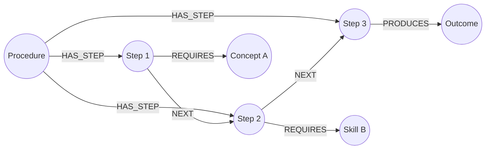

`HAS_STEP` records membership; `NEXT` records instructional/execution order. Keeping both makes a procedure recoverable when one ordering edge is uncertain and allows the UI to list all steps. A procedure must have exactly one first step after validation unless it is explicitly marked incomplete. Branches are allowed only when supported by source evidence and should carry a condition property or rationale.

### 7.4 Controlled relationship vocabulary

The model must choose from a small enum. It must never invent edge labels.

| Relation | Direction | Planning meaning |
| --- | --- | --- |
| `REQUIRES` | A → B means A requires B | B should usually precede A |
| `PART_OF` | A → B means A is part of B | Useful for scope grouping |
| `EXAMPLE_OF` | A → B means A exemplifies B | Usually secondary material |
| `CONTRASTS_WITH` | A ↔ B stored as directed pair or canonical direction | Useful for comparison practice |
| `APPLIED_IN` | A → B means A is applied in B | Contextual relevance |
| `DERIVED_FROM` | A → B means A derives from B | B normally precedes A |
| `RELATED_TO` | Weak semantic relation | Retrieval aid; never a hard prerequisite |
| `HAS_STEP` | Procedure → procedure step | Membership; does not by itself define order |
| `NEXT` | Procedure step → procedure step | Hard local order within one procedure |
| `PRODUCES` | Procedure or step → entity | Describes the result or learned outcome |

`REQUIRES`, `NEXT`, and, when appropriate, `DERIVED_FROM` create hard planning precedence. `NEXT` applies only within the same procedure. The other relations affect relevance, grouping, or artifact selection but do not automatically determine order.

### 7.5 Deletion and rebuild behavior

Deleting a document must remove its chunks and evidence. An entity or relationship is removed only when no remaining evidence supports it. For the hackathon, the simplest safe implementation is:

1. delete the document and derived evidence;
2. mark potentially affected entity/relationship registries stale;
3. rebuild that course's AGE vertices and relationships from all remaining chunks inside a versioned transaction; and
4. preserve completed study sessions as historical snapshots or clearly invalidate them.

Incremental perfect graph repair is out of scope. Rebuild completion must run the registry/topology reconciliation check before publishing the new graph version.

---

## 8. Ingestion and intelligence pipeline

### 8.1 Pipeline stages

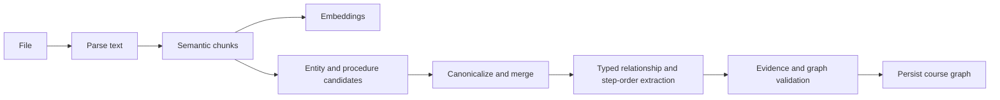

### 8.2 File validation

- Validate extension and detected MIME type.
- Set a conservative file-size limit in configuration.
- Hash bytes before parsing to identify duplicate uploads within a course.
- Sanitize filenames and generate internal storage names.
- Never execute macros, embedded scripts, or linked content.
- Reject password-protected files with an actionable error.
- Treat scanned PDFs without extractable text as unsupported for the MVP unless local OCR is intentionally added.

### 8.3 Parsing

Suggested local libraries:

- PDF: PyMuPDF or pypdf, retaining page numbers;
- DOCX: python-docx, retaining headings when available;
- Markdown/TXT: native decoding plus heading parsing;
- token counting: provider-compatible tokenizer when available, otherwise a conservative approximation.

Normalize:

- Unicode;
- repeated whitespace;
- hyphenated line breaks;
- empty headers/footers when safely detectable; and
- common page-number-only lines.

Do not aggressively remove repeated text if it risks deleting definitions or formulas.

### 8.4 Chunking

Use semantic boundaries before raw token windows:

1. split by document/page/heading structure;
2. combine small adjacent blocks under a target token size;
3. split oversized blocks with limited overlap;
4. retain page and section metadata on every chunk; and
5. never combine unrelated pages solely to hit a target size.

Recommended starting configuration:

- target: 500–800 tokens;
- maximum: approximately 1,000 tokens;
- overlap: 75–120 tokens only when splitting the same semantic block.

Chunk parameters must be configuration values and written into ingestion metadata for debugging.

### 8.5 Embedding

- Batch embedding requests to reduce latency.
- Choose the embedding model and dimensions before creating the production migration.
- Store model name and embedding pipeline version.
- Skip re-embedding chunks with the same normalized-text hash and model version.
- Use cosine distance consistently.
- Keep requests within the selected provider; adding a second provider is out of scope.

### 8.6 Knowledge-entity and procedure extraction

Extraction is structured inference, not free-form generation. For each chunk or coherent batch, the model returns strict JSON containing concepts and any source-supported procedures with independently actionable steps. A procedure must not be emitted when the source merely lists related facts without an intended order.

```json
{
  "entities": [
    {
      "name": "Gradient Descent",
      "type": "CONCEPT",
      "description": "An optimization method that iteratively updates parameters using a loss gradient.",
      "aliases": ["GD"],
      "importance": 0.88,
      "confidence": 0.94,
      "evidence": [
        {
          "chunk_id": "uuid",
          "excerpt": "...",
          "support_score": 0.96
        }
      ]
    },
    {
      "name": "Perform Gradient Descent Update",
      "type": "PROCEDURE",
      "description": "Update model parameters for one optimization iteration.",
      "steps": [
        {
          "local_key": "compute-gradient",
          "name": "Compute the loss gradient",
          "position": 1,
          "requires": ["derivatives-id"],
          "evidence": [{"chunk_id": "uuid", "excerpt": "...", "support_score": 0.95}]
        },
        {
          "local_key": "update-parameters",
          "name": "Update the parameters",
          "position": 2,
          "evidence": [{"chunk_id": "uuid", "excerpt": "...", "support_score": 0.94}]
        }
      ],
      "evidence": [{"chunk_id": "uuid", "excerpt": "...", "support_score": 0.93}]
    }
  ]
}
```

Validation rules:

- reject unknown entity types;
- reject a procedure whose steps lack evidence or whose order is unsupported;
- generate separate canonical UUIDs for the procedure and every accepted procedure step;
- convert procedure membership and order into `HAS_STEP` and `NEXT` relationships during canonicalization;
- reject missing evidence;
- bound all scores to 0–1;
- limit description and excerpt lengths;
- verify cited chunk IDs were included in the prompt;
- parse through a typed schema; and
- retry once with a repair prompt before failing the stage.

### 8.7 Entity resolution

Entity resolution prevents duplicate nodes such as `GD`, `gradient-descent`, and `Gradient Descent`. Procedure steps are resolved in the context of their parent procedure so generic labels such as “Verify result” do not merge across unrelated workflows.

Resolution pipeline:

1. normalize case, punctuation, whitespace, and common formatting;
2. exact-match canonical name or aliases within the same course;
3. retrieve nearest existing entity embeddings;
4. compare entity type, candidate description, aliases, parent procedure when applicable, and overlapping evidence;
5. ask the model for a bounded `MERGE`, `KEEP_SEPARATE`, or `SUBTYPE` decision only for ambiguous candidates; and
6. preserve all source aliases on merge.

Never merge solely because embedding similarity is high. “Regression” and “logistic regression” are related but should not automatically collapse into one node.

For the MVP, `SUBTYPE` can become a separate node connected with `PART_OF` or `RELATED_TO`; a dedicated ontology is unnecessary.

### 8.8 Relationship extraction

Relationship extraction uses canonical entity IDs plus source chunks. The model returns only allowed relation types and must provide evidence. Deterministic code creates `HAS_STEP` and adjacent `NEXT` relationships from a validated ordered procedure response; the model does not separately improvise those edges.

```json
{
  "edges": [
    {
      "source_entity_id": "gradient-descent-id",
      "target_entity_id": "derivatives-id",
      "relation_type": "REQUIRES",
      "confidence": 0.91,
      "rationale": "Understanding derivatives is necessary to interpret the update rule.",
      "evidence": [
        {
          "chunk_id": "lecture-4-page-7-chunk",
          "excerpt": "Gradient descent updates parameters using the derivative of the loss function.",
          "support_score": 0.95
        }
      ]
    }
  ]
}
```

Direction must be tested with examples. Under this specification, `A REQUIRES B` means B must appear before A in a learning route.

### 8.9 Graph validation

Before activation:

- confirm source and target belong to the same course;
- confirm `HAS_STEP` targets are `PROCEDURE_STEP` entities and both endpoints belong to the same course;
- confirm each active procedure has one entry step, contains all of its steps through `HAS_STEP`, and has no unsupported `NEXT` branch;
- reject self-loops unless explicitly allowed for a relation type; default to reject;
- deduplicate identical typed edges;
- confirm evidence chunks belong to the course;
- downgrade edges below the confidence threshold to `REVIEW`;
- detect strongly connected components in hard precedence edges;
- suppress the lowest-confidence edge in each hard cycle for planning while retaining it for inspection; and
- record the extraction and validation versions.
- reconcile relational registry UUIDs with AGE vertex/relationship UUID properties before publishing the graph version.

### 8.10 Prompt-injection handling

Uploaded notes are untrusted data. They may accidentally or deliberately contain instructions such as “ignore previous instructions.” Every model prompt must:

- state that source text is quoted data, not instruction;
- use clear delimiters around source content;
- request only a fixed schema;
- avoid tools or autonomous actions;
- validate all returned identifiers; and
- never allow source content to select providers, URLs, system behavior, or secrets.

### 8.11 Privacy boundary

The application is local-first, not fully offline. This must be described accurately.

Data stored locally:

- original uploaded files;
- extracted text;
- chunks and embeddings;
- knowledge entities, AGE topology, and relationship registries;
- study sessions and generated artifacts;
- narration cache; and
- operational logs with redacted payloads.

Data sent externally:

- selected source chunks for embeddings or structured model inference;
- structured entity/relationship context for planning and artifact generation; and
- generated narration text sent to ElevenLabs.

Never send:

- the full local database;
- unrelated courses;
- local paths;
- provider secrets;
- unnecessary document metadata; or
- more source text than required for the active inference task.

---

## 9. Retrieval and planning

### 9.1 Objective representation

The UI collects free-form text plus an explicit time value. The backend normalizes it to:

```json
{
  "goal_text": "Study Units 1–3 for tomorrow's exam. I am weak at recursion.",
  "scope_text": "Units 1–3",
  "available_minutes": 120,
  "weaknesses": ["recursion"],
  "preferences": [],
  "target_concept_hints": []
}
```

Do not rely on extracting time perfectly from prose; the UI should expose a numeric time input with a sensible default.

### 9.2 Target retrieval

Use relational hybrid retrieval across `knowledge_entities` and `chunks` to identify seed entity UUIDs, then pass those UUIDs to AGE for topology expansion. Score across:

- knowledge-entity embedding similarity to the goal;
- chunk embedding similarity to the goal;
- lexical matches for unit/chapter/heading labels;
- knowledge-entity importance;
- document filters selected by the user; and
- user-stated weakness matches.

A simple weighted score is adequate:

\[
S(e) = 0.40V_e + 0.25V_s + 0.15L + 0.10I + 0.10W
\]

Where:

- \(V_e\): knowledge-entity vector similarity;
- \(V_s\): strongest supporting chunk similarity;
- \(L\): lexical/scope match;
- \(I\): knowledge-entity importance; and
- \(W\): weakness match.

Weights are configuration, not product truth. Validate them against the prepared demo course.

### 9.3 Subgraph construction

1. Select the top goal-relevant entity UUIDs above a minimum score from relational/vector retrieval.
2. Use an AGE Cypher query to walk backward across `REQUIRES` and `DERIVED_FROM` relationships to a bounded depth.
3. If a selected entity is a procedure or procedure step, include its `HAS_STEP` membership, required `NEXT` chain, and step-specific prerequisites.
4. Include supporting parent/group concepts through `PART_OF` when they improve explanation.
5. Include weakness-matched entities even if their raw relevance score is slightly lower.
6. Remove isolated low-score nodes.
7. Cap total nodes to maintain legibility and prompt bounds.
8. Hydrate AGE results from relational metadata/evidence by application UUID; never join through AGE `graphid`.
9. Preserve every relationship and entity citation used in the final subgraph.

Recommended starting limits:

- initial targets: 5–10;
- prerequisite depth: 2–4;
- displayed goal subgraph: 10–30 nodes;
- hard upper bound: 50 nodes for an MVP response.

### 9.4 Ordering

For hard precedence, convert semantic direction into planning direction:

```text
Semantic edge:      Gradient Descent REQUIRES Derivatives
Planning edge:      Derivatives -> Gradient Descent
```

AGE retrieves the bounded planning subgraph; deterministic Python code owns policy-sensitive cycle resolution, topological ordering, tie-breaking, and time allocation. Then:

1. create the planning DAG from active `REQUIRES`, applicable `DERIVED_FROM`, and procedure-local `NEXT` relationships;
2. detect cycles;
3. suppress the lowest-confidence edge participating in a cycle for this plan;
4. topologically sort the remaining graph;
5. break ties using weakness, relevance, importance, and dependency centrality; and
6. record any suppressed relationships in the plan explanation.

Procedure steps remain contiguous when practical. A hard prerequisite of a procedure step must occur before that step, but unrelated material should not be inserted between adjacent `NEXT` steps unless the plan explicitly explains the interruption.

The model may help estimate difficulty or select activity types, but it must not override a validated hard prerequisite without producing an explicit exception.

### 9.5 Priority score

A practical heuristic:

\[
P(c) = 0.30R + 0.25W + 0.20D + 0.15I + 0.10U
\]

Where:

- \(R\): goal relevance;
- \(W\): weakness signal;
- \(D\): downstream dependency count normalized within the subgraph;
- \(I\): source-derived importance; and
- \(U\): uncertainty or low mastery.

The topological constraints decide what **may** come next; the priority score decides which eligible node **should** come next.

### 9.6 Time allocation

Each step gets:

- a minimum useful duration, such as 5 minutes;
- a base duration by entity type/difficulty;
- additional time for weakness and downstream importance; and
- reduced time for known/mastered concepts.

If the requested path exceeds the budget:

1. preserve hard prerequisites;
2. reduce or remove low-priority contextual nodes;
3. change low-priority nodes from `LEARN` to `REVIEW`;
4. remove optional examples before core concepts; and
5. report omitted concepts instead of pretending the full scope fits.

The sum of allocated minutes must be less than or equal to `available_minutes`. Any remaining minutes may be assigned to mixed practice or a final check.

### 9.7 Plan explanation

Every step must answer:

- Why is this concept included?
- Why does it appear at this position?
- Which later concept depends on it, if any?
- Which source supports the relationship?
- What activity should the learner perform?

Example:

> **Recursion — 20 minutes — Review**  
> Included because you marked it as a weakness and Trees depends on recursive reasoning in Lecture 3. Review the base-case and recursive-step examples before moving to tree traversal. Sources: Lecture 2 p. 14; Lecture 3 p. 4.

### 9.8 Rerouting

Rerouting creates a new study-session version. Inputs may change because:

- available time changed;
- a step was completed;
- the user marked a concept known;
- diagnostic results changed mastery; or
- the goal/scope changed.

The course graph remains stable unless source material changes. A reroute recomputes the goal subgraph, ordering, and time allocation; it does not re-ingest files.

---

## 10. Study materials and voice

### 10.1 Study artifact contract

Artifacts are generated per study step, preferably on demand and cached. This limits latency and API cost during initial route generation.

#### Summary payload

```json
{
  "title": "Recursion refresher",
  "learning_objective": "Identify the base case and recursive step in a function.",
  "summary_markdown": "...",
  "key_points": ["..."],
  "common_confusions": ["..."],
  "citations": [{"chunk_id": "uuid", "label": "Lecture 2, p. 14"}]
}
```

#### Flashcard payload

```json
{
  "cards": [
    {
      "front": "What prevents infinite recursion?",
      "back": "A reachable base case that stops further recursive calls.",
      "citation_chunk_ids": ["uuid"]
    }
  ]
}
```

#### Question payload

```json
{
  "questions": [
    {
      "prompt": "Identify the base case in the supplied example.",
      "type": "SHORT_ANSWER",
      "expected_points": ["..."],
      "explanation": "...",
      "citation_chunk_ids": ["uuid"]
    }
  ]
}
```

### 10.2 Grounding rules

- All factual teaching content must use retrieved chunks from the active course.
- The model may create novel practice questions, but expected answers must be supported by cited content.
- Generated analogies must be labeled as AI-generated explanations.
- If evidence is insufficient, say so and direct the learner to the source rather than inventing detail.
- External general knowledge is disabled by product policy even if the model internally possesses it.

### 10.3 ElevenLabs narration

Narration is a backend-mediated transformation:

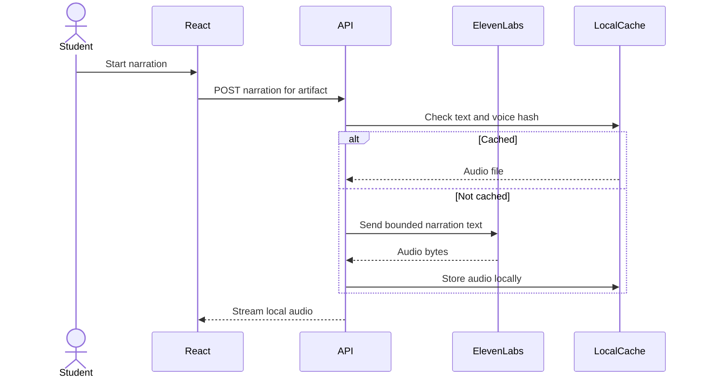

Requirements:

- Do not send citations, hidden prompts, or raw unrelated chunks to ElevenLabs.
- Strip Markdown syntax into narration-friendly text.
- Enforce a character limit and split long content.
- Cache by hash of normalized text, voice ID, and voice settings.
- Provide text mode when the ElevenLabs key is absent or quota is exhausted.
- Never expose the ElevenLabs key in React environment variables.

### 10.4 Voice input

Voice input is P2. If implemented, it must produce the same objective payload as typed input and must not create a parallel planning path. The typed transcript must be visible and editable before submission.

---

## 11. API contract

### 11.1 Contract rules

- Prefix all routes with `/api/v1`.
- Use UUID strings.
- Return stable machine-readable error codes.
- Return timestamps as ISO 8601 UTC.
- Use cursor pagination for large collections; the MVP graph may return one bounded payload.
- Generate and commit an OpenAPI schema.
- Generate TypeScript types or validate manually against the schema.
- Never return local filesystem paths.

### 11.2 Minimum endpoints

| Method | Route | Purpose | Owner |
| --- | --- | --- | --- |
| `POST` | `/courses` | Create course | Person 1 |
| `GET` | `/courses` | List local courses | Person 1 |
| `GET` | `/courses/{course_id}` | Course details | Person 1 |
| `POST` | `/courses/{course_id}/documents` | Upload one or more files | Person 1 |
| `GET` | `/courses/{course_id}/documents` | Source list and states | Person 1 |
| `DELETE` | `/documents/{document_id}` | Delete and schedule rebuild | Person 1 |
| `GET` | `/jobs/{job_id}` | Poll processing state | Person 1 |
| `GET` | `/courses/{course_id}/graph` | Full graph DTO | Person 1 with Person 2 contract |
| `POST` | `/courses/{course_id}/study-sessions` | Create goal-specific route | Person 2 |
| `GET` | `/study-sessions/{session_id}` | Get route and subgraph | Person 2 |
| `POST` | `/study-steps/{step_id}/artifacts` | Generate/cache study material | Person 2 |
| `POST` | `/study-artifacts/{artifact_id}/narration` | Generate/cache narration | Person 2 |
| `GET` | `/narrations/{narration_id}/audio` | Stream local audio | Person 2 |
| `PATCH` | `/study-steps/{step_id}` | Complete/skip step | Person 1 or 2; freeze ownership on day zero |
| `POST` | `/study-sessions/{session_id}/reroute` | Create revised session | Person 2 |

### 11.3 Graph response DTO

```json
{
  "course_id": "uuid",
  "graph_version": "2026-09-12T10:30:00Z",
  "nodes": [
    {
      "id": "uuid",
      "name": "Gradient Descent",
      "type": "PROCEDURE",
      "description": "...",
      "importance": 0.88,
      "confidence": 0.94,
      "aliases": ["GD"],
      "source_count": 2
    }
  ],
  "edges": [
    {
      "id": "uuid",
      "source": "entity-uuid",
      "target": "entity-uuid",
      "relation_type": "REQUIRES",
      "confidence": 0.91,
      "rationale": "...",
      "evidence": [
        {
          "chunk_id": "uuid",
          "document_id": "uuid",
          "label": "Lecture 4, p. 7",
          "excerpt": "..."
        }
      ]
    }
  ]
}
```

### 11.4 Study-session request

```json
{
  "goal_text": "Prepare for an exam covering Units 1–3",
  "available_minutes": 120,
  "weakness_text": "I struggle with recursion",
  "document_ids": [],
  "preferences": {
    "focus": "BALANCED"
  }
}
```

### 11.5 Study-session response

```json
{
  "id": "uuid",
  "status": "READY",
  "goal_text": "Prepare for an exam covering Units 1–3",
  "available_minutes": 120,
  "allocated_minutes": 120,
  "explanation": "The route begins with recursion because it is a stated weakness and a prerequisite for tree traversal.",
  "steps": [
    {
      "id": "uuid",
      "position": 1,
      "knowledge_entity_id": "uuid",
      "entity_name": "Recursion",
      "entity_type": "CONCEPT",
      "allocated_minutes": 20,
      "activity_type": "REVIEW",
      "reason": "Stated weakness and prerequisite for Trees",
      "citation_labels": ["Lecture 2, p. 14"]
    }
  ],
  "subgraph": {
    "nodes": [],
    "edges": []
  },
  "omitted_entities": [
    {
      "knowledge_entity_id": "uuid",
      "reason": "Lower priority than available time permits"
    }
  ]
}
```

### 11.6 Error envelope

```json
{
  "error": {
    "code": "MODEL_UNAVAILABLE",
    "message": "The model provider could not complete graph extraction.",
    "retryable": true,
    "request_id": "uuid",
    "details": {}
  }
}
```

Never send stack traces, prompts, provider credentials, or raw provider responses to the browser.

---

## 12. Three-person separable responsibility model

### 12.1 Parallelization principle

The team should not divide work by arbitrary frontend/backend percentages. Each person owns a vertically testable system with explicit input/output contracts and local fixtures. Integration occurs through versioned contracts, not shared assumptions.

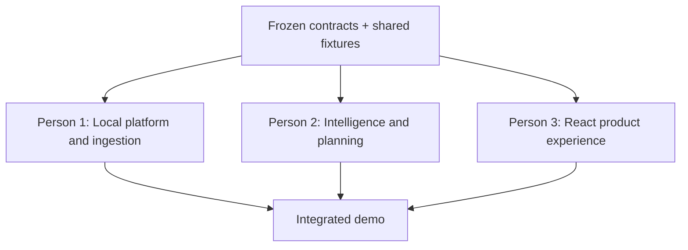

### 12.2 Person 1 — Local Platform and Ingestion Owner

**Mission:** Make source material durable, queryable, and operationally reliable on one laptop.

**Owns:**

- pinned Docker Compose PostgreSQL configuration with pgvector and Apache AGE;
- migrations and seed data;
- course, document, chunk, entity/relationship registry, evidence, job, and AGE topology persistence;
- file upload, validation, hashing, and local storage;
- PDF/DOCX/TXT/MD parsing;
- chunking and source-location metadata;
- embedding batch orchestration through the shared model adapter interface;
- PostgreSQL vector indexes and hybrid retrieval primitives;
- durable job worker and ingestion status endpoints;
- full graph read DTO assembly;
- deletion/rebuild behavior; and
- backend health/readiness endpoint.

**Does not own:**

- extraction prompt semantics;
- entity-resolution decisions;
- relationship classification;
- path-planning algorithms;
- React components; or
- ElevenLabs integration.

**Inputs from others:**

- Person 2 supplies pure/typed intelligence functions or a service interface for entity, procedure, and relationship extraction.
- Team supplies frozen embedding model and dimension.

**Outputs to others:**

- running PostgreSQL schema;
- stable REST endpoints for courses, documents, jobs, and graph reads;
- `chunks` retrieval/repository interface;
- `GraphRepository` implementation for Person 2;
- committed OpenAPI schema; and
- seeded demo database path/script.

**Independent test fixture:**

- a small local Markdown course with known headings and chunks;
- a fake embedding adapter returning deterministic vectors; and
- a static graph fixture used to test persistence without model calls.

**Definition of done:**

1. `docker compose up db` succeeds on a clean machine.
2. Migrations enable pgvector and AGE, create the `graphite` AGE graph, and create all required relational tables.
3. Upload returns IDs immediately and the worker advances through visible stages.
4. Parsing retains page or section references.
5. A worker restart does not permanently strand a job.
6. Completed graph data survives API restart.
7. Vector search returns course-scoped results.
8. Model failure becomes a retryable job failure.

### 12.3 Person 2 — Intelligence, Graph, Planning, and Voice Owner

**Mission:** Turn chunks into an evidence-backed graph and turn a goal into an explainable route.

**Owns:**

- provider-neutral model client interface and configured provider implementation;
- structured prompt templates;
- typed model response schemas;
- concept, procedure, and procedure-step extraction;
- entity resolution and canonicalization;
- typed relationship extraction and deterministic procedure topology construction;
- evidence validation and confidence thresholds;
- graph validation, cycle detection, and edge suppression policy;
- goal parsing and hybrid entity-scoring logic;
- prerequisite expansion and goal-subgraph construction;
- topological ordering and time allocation;
- plan explanations and omitted-concept reporting;
- source-grounded summary/flashcard/question generation;
- ElevenLabs backend adapter, narration normalization, and cache key logic; and
- intelligence-specific unit tests and golden fixtures.

**Does not own:**

- browser UI;
- file upload/storage;
- low-level parsers;
- PostgreSQL migrations, except proposing schema changes through the contract process; or
- deployment/cloud infrastructure.

**Inputs from others:**

- Person 1 provides `ChunkRepository`, `GraphRepository`, and session persistence interfaces.
- Person 3 provides the final rendering needs through frozen DTOs, not ad hoc database requests.

**Outputs to others:**

- typed functions/services:
  - `extract_entities(chunks) -> EntityCandidates`;
  - `resolve_entities(candidates, existing) -> ResolutionPlan`;
  - `extract_relationships(entities, chunks) -> RelationshipCandidates`;
  - `build_procedure_topology(procedure) -> ProcedureRelationships`;
  - `validate_graph(graph) -> ValidatedGraph`;
  - `build_study_session(goal, graph, retrieval) -> StudySessionDTO`;
  - `generate_artifact(step, evidence, type) -> ArtifactDTO`;
  - `generate_narration(text, voice) -> NarrationResult`;
- deterministic mock implementations;
- JSON golden files for expected graph and route; and
- provider error mapping.

**Independent test fixture:**

- a fixed chunk bundle for a tiny data-structures course;
- a prebuilt canonical graph in JSON;
- a fake model adapter returning exact schema-valid responses; and
- goal cases with expected prerequisite order and budget totals.

**Definition of done:**

1. All model outputs are schema-validated.
2. Every activated entity and relationship has valid evidence.
3. Each complete procedure fixture has correct `HAS_STEP` membership and an evidence-backed `NEXT` chain.
4. Duplicate aliases merge in the golden fixture without collapsing distinct subtypes or unrelated generic step names.
5. Hard cycles produce a deterministic, logged suppression decision.
6. A path respects prerequisites and procedure order and fits the minute budget.
7. The same fixture and goal produce stable structural output.
8. Artifact content cites only supplied chunk IDs.
9. Narration works when configured and degrades cleanly when absent.

### 12.4 Person 3 — React Product Experience and Demo Owner

**Mission:** Make the graph-to-route transformation obvious, fast, and trustworthy to a first-time user.

**Owns:**

- React + TypeScript application setup;
- routing and course workspace state;
- upload/dropzone and source-status interface;
- job polling and retry interactions;
- full graph and goal-subgraph rendering with React Flow;
- layout, node/edge styles, legends, and evidence drawers;
- objective composer and structured time input;
- learning-route panel and omitted-content disclosure;
- study mode, flashcards, questions, and completion interactions;
- audio playback controls for narration;
- all loading, empty, error, and degraded states;
- responsive behavior and baseline accessibility;
- frontend mock service and fixture-driven development;
- demo dataset presentation, stage script, and screen-flow rehearsal; and
- final visual freeze.

**Does not own:**

- database schema;
- provider calls or secrets;
- graph extraction and planning semantics;
- file parsing; or
- backend job execution.

**Inputs from others:**

- committed OpenAPI schema and error envelope;
- graph, session, artifact, and job fixtures;
- local audio endpoint contract; and
- source-location labels.

**Outputs to others:**

- exact DTO fields required for rendering, proposed before contract freeze;
- mock API implementation matching the OpenAPI contract;
- end-to-end UI states for ready, loading, empty, and failed responses;
- demo route and interaction timing; and
- integration defect reports expressed as contract violations.

**Independent test fixture:**

- Mock Service Worker or equivalent local mock layer;
- static documents/job/graph/session/artifact JSON;
- cached narration audio sample; and
- deterministic graph positions for screenshots and rehearsal.

**Definition of done:**

1. The entire demo can run against mocks before backend integration.
2. A user can upload and understand every ingestion state.
3. A graph node and edge both reveal evidence.
4. Submitting a goal visibly transforms the graph into a route.
5. The route clearly fits the time budget.
6. Study mode renders every artifact type and citations.
7. Voice failure does not block study mode.
8. The UI remains understandable on a common laptop viewport.

### 12.5 Shared responsibilities

Only the following are shared; every other item has one owner:

- freeze product scope;
- approve OpenAPI and JSON schemas;
- select model/embedding configuration;
- choose the prepared demo corpus;
- review golden graph correctness;
- conduct integration checkpoints;
- rehearse the pitch; and
- decide cuts using the scope kill order.

“Shared” does not mean “nobody owns it.” Assign a meeting driver for each shared decision. Person 1 is the default contract and integration driver; Person 3 is the default demo driver.

### 12.6 Responsibility matrix

| Capability | Person 1 | Person 2 | Person 3 |
| --- | --- | --- | --- |
| PostgreSQL/pgvector/AGE | **A/R** | C | I |
| File parsing/chunking | **A/R** | C | I |
| Embedding orchestration | **A/R** | C | I |
| Model adapter semantics | C | **A/R** | I |
| Entity/procedure/relationship extraction | C | **A/R** | I |
| Graph persistence | **A/R** | C | I |
| Graph algorithms | C | **A/R** | I |
| Study artifacts | I | **A/R** | C |
| ElevenLabs backend | I | **A/R** | C |
| REST contracts | **A** | R/C | R/C |
| React UI | I | C | **A/R** |
| Demo flow | C | C | **A/R** |
| End-to-end integration | **A/R** | R | R |

Legend: **A** = accountable, **R** = responsible, C = consulted, I = informed.

---

## 13. Parallel execution and integration strategy

### 13.1 Hour-zero contract freeze

Before feature coding, spend no more than 60–90 minutes agreeing on:

1. repository layout;
2. environment variable names;
3. model provider, model IDs, embedding dimension, and budgets;
4. table/enum meanings;
5. endpoint paths;
6. graph and study-session DTOs;
7. error envelope;
8. sample course fixture; and
9. Git workflow.

The result is committed under `packages/contracts` as:

- `openapi.json` or `openapi.yaml`;
- `graph.schema.json`;
- `study-session.schema.json`;
- `artifact.schema.json`;
- `errors.md`; and
- example JSON fixtures.

### 13.2 Mock-first dependency elimination

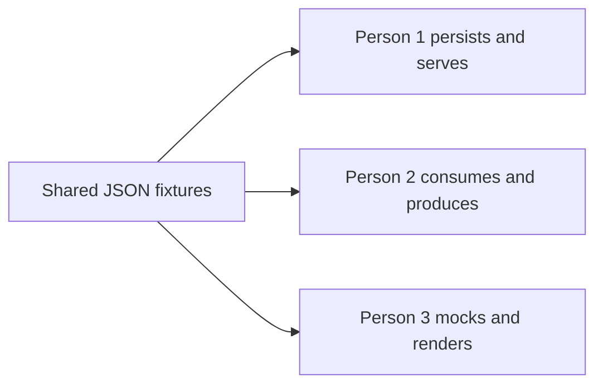

- Person 1 can persist a static graph before Person 2's extraction exists.
- Person 2 can develop against in-memory repositories before migrations are complete.
- Person 3 can complete the demo UI before any live endpoint exists.
- Integration replaces mocks one boundary at a time.

### 13.3 Suggested branch ownership

- `feature/platform-ingestion` — Person 1
- `feature/intelligence-planner` — Person 2
- `feature/react-experience` — Person 3
- short contract changes go through small pull requests or direct reviewed commits;
- avoid all three people repeatedly editing the same bootstrap files;
- assign one owner for dependency manifests and environment examples.

### 13.4 Integration checkpoints

#### Checkpoint A — Contract and skeleton

- Database starts.
- API returns health.
- React renders the workspace from fixtures.
- Intelligence tests run on fixtures.

#### Checkpoint B — Live upload

- React uploads to API.
- API writes document/job state.
- UI polls live job status.
- Graph still comes from fixture.

#### Checkpoint C — Live graph

- One prepared file completes parse → embed → extract → persist.
- React renders the live graph.
- Node and edge evidence opens.

#### Checkpoint D — Live route

- Objective creates a live study session.
- Subgraph and steps render.
- Time budget and citations are correct.

#### Checkpoint E — Artifact and optional voice

- One step generates a live artifact.
- Narration works or the product cleanly demonstrates text fallback.
- Demo seed/cache is prepared.

### 13.5 Change-control rule

After Checkpoint B, a contract change requires:

1. owner states the broken use case;
2. proposed schema diff is written first;
3. all three owners acknowledge impact;
4. fixtures and contract update in the same commit; and
5. backward compatibility is preferred when cheaper than coordinated churn.

No one should “just rename a field” across a three-person hackathon codebase.

---

## 14. Delivery plan

The exact hour counts should be scaled to the event, but dependencies and cut points remain the same.

### Phase 0 — Product and contract lock

**Team:** all  
**Exit:** one story, one fixture, one schema, one demo path.

- Choose the demo course and goal.
- Manually sketch the expected graph.
- Agree on the relation vocabulary.
- Freeze API examples.
- Create `.env.example` with placeholder keys.
- Confirm each developer can start PostgreSQL.

### Phase 1 — Independent vertical skeletons

**Person 1:** database, migrations, course/document endpoints, job skeleton.  
**Person 2:** model adapter interface, fake provider, extraction/planning schemas, graph-algorithm tests.  
**Person 3:** full UI from fixtures, including graph, route, evidence, and study screens.

**Exit:** each lane demonstrates independently.

### Phase 2 — Ingestion integration

**Person 1:** real parsing, chunks, embeddings, worker.  
**Person 2:** real structured extraction and entity resolution against fixture chunks.  
**Person 3:** live upload, document stages, error/retry UI.

**Exit:** one file creates a persisted, inspectable graph.

### Phase 3 — Planning integration

**Person 1:** repositories and graph/session persistence.  
**Person 2:** goal retrieval, subgraph, topological order, time budget, explanations.  
**Person 3:** objective composer and full-to-goal graph transition.

**Exit:** a live goal produces a cited route.

### Phase 4 — Study experience

**Person 1:** final resilience and seed/caching support.  
**Person 2:** artifacts, then narration if stable.  
**Person 3:** study mode, then playback and polish.

**Exit:** one route step can be studied end to end.

### Phase 5 — Freeze and rehearse

- Stop adding features.
- Run the clean-machine setup.
- Seed or pre-ingest the backup demo course.
- Test provider failure and missing voice key.
- Verify citations.
- Record a backup demo video if rules permit.
- Rehearse the product story and technical explanation.
- Preserve a known-good commit.

---

## 15. Model-call design

### 15.1 Provider adapter

All model interactions pass through one interface supporting:

- structured chat completion;
- embeddings;
- request timeout;
- bounded retry with jitter;
- token/character accounting;
- model metadata logging;
- schema-validation error mapping; and
- fake deterministic responses.

Business logic must not import a provider SDK directly.

### 15.2 Call inventory

| Call | Timing | Input | Output | Cache key |
| --- | --- | --- | --- | --- |
| Chunk embeddings | Ingestion | Normalized chunks | Vectors | text hash + model |
| Entity/procedure extraction | Ingestion | Bounded chunk batch | Candidates/evidence/ordered steps | chunk hashes + prompt version |
| Entity decision | Ambiguous merge only | Candidate + nearest entities | Merge decision | candidate/existing/version |
| Relationship extraction | Ingestion | Canonical entities + chunks | Typed relationships/evidence | graph inputs + prompt version |
| Goal parsing | Session creation | Goal text | Structured goal | goal hash + prompt version |
| Optional ranking | Session creation | Bounded subgraph context | Scores/difficulty | graph version + goal hash |
| Artifact generation | On demand | Step + evidence | Structured artifact | step/evidence/type/version |

### 15.3 Cost and latency controls

- Hash and cache every deterministic transformation.
- Batch chunks, but keep prompts small enough to preserve evidence locality.
- Generate artifacts on demand.
- Do not regenerate the course graph when only the goal changes.
- Cap extracted entities and procedure steps per chunk/batch.
- Cap entity-resolution candidates.
- Retry malformed JSON once, not indefinitely.
- Expose timing logs locally for debugging.
- Prepare a small, representative demo corpus.

### 15.4 Prompt versioning

Store prompt identifiers such as:

- `entity-procedure-extract-v1`;
- `entity-resolve-v1`;
- `relationship-extract-v1`;
- `goal-parse-v1`; and
- `artifact-summary-v1`.

Prompt versions should appear in job or artifact metadata. Do not store hidden provider reasoning.

### 15.5 Model output repair policy

1. Parse response against the schema.
2. If invalid, run one narrowly scoped repair request containing the invalid structure and validation errors.
3. If still invalid, fail the stage with `MODEL_SCHEMA_INVALID`.
4. Preserve prior successful stages.
5. Allow user retry.

---

## 16. Security, privacy, and operational constraints

### 16.1 Secrets

Expected environment variables:

```text
DATABASE_URL=postgresql://...
MODEL_API_KEY=...
MODEL_CHAT_MODEL=...
MODEL_EMBEDDING_MODEL=...
EMBEDDING_DIMENSIONS=...
ELEVENLABS_API_KEY=...
ELEVENLABS_VOICE_ID=...
UPLOAD_DIR=...
```

- Commit `.env.example`, never `.env`.
- Browser bundles contain only the local API base URL.
- Logs redact authorization headers and keys.
- Provider errors are sanitized.

### 16.2 Local API exposure

- Bind to `127.0.0.1` by default.
- Permit CORS only from the configured local frontend origin.
- Enforce upload limits server-side.
- Do not expose directory browsing.
- Return files/audio through ID-based endpoints.

### 16.3 Data retention

For the MVP:

- data remains until the user deletes the course or local database volume;
- deleting a course cascades database records and removes associated local files/audio;
- provide a visible destructive confirmation; and
- document that external providers may process supplied request data according to their configured policies.

### 16.4 Logging

Log:

- request ID;
- endpoint and status;
- job ID/stage/duration;
- provider model and latency;
- token counts when available;
- validation failure type; and
- graph counts before/after resolution.

Do not log:

- complete document text;
- complete prompts by default;
- API keys;
- raw audio; or
- hidden provider metadata.

---

## 17. Failure modes and mitigations

| Failure | User impact | Mitigation | Priority |
| --- | --- | --- | --- |
| Scanned PDF has no text | Empty ingestion | Detect early; request text-based export | P0 |
| Model returns malformed JSON | Stage failure | Typed validation + one repair retry | P0 |
| Duplicate concepts | Noisy graph | Normalization + embedding candidates + bounded merge decision | P0 |
| Hallucinated edge | Wrong route | Required evidence, confidence, and click-to-inspect | P0 |
| Prerequisite cycle | Topological sort fails | SCC detection; suppress lowest-confidence cycle edge | P0 |
| Huge graph | UI unreadable | Goal subgraph and node caps | P0 |
| Goal retrieves wrong scope | Bad route | Hybrid retrieval, explicit source filters, show selected targets | P0 |
| Time plan exceeds budget | Broken promise | Deterministic sum validation and omission policy | P0 |
| Worker crashes | Stuck document | Durable jobs and stale-lock recovery | P0 |
| Provider rate limit | Slow/failed ingestion | Batching, cache, backoff, prepared demo data | P0 |
| pgvector dimension mismatch | Insert failure | Freeze model/dimension and validate startup config | P0 |
| AGE/pgvector image incompatibility | Database cannot start cleanly | Pin PostgreSQL and both extension versions; test the exact image on a clean teammate machine | P0 |
| AGE topology and relational registry drift | Missing metadata/evidence or broken graph response | Shared UUIDs, one-transaction writes, repository-only Cypher, and reconciliation before publishing a graph version | P0 |
| Ambiguous procedure order | Misleading study sequence | Require step-level evidence; mark incomplete/branching procedures for review instead of inventing a linear chain | P0 |
| Browser exposes key | Security incident | Backend-only provider adapters | P0 |
| Voice fails | Optional feature unavailable | Text-first study mode | P1 |
| Source file deleted locally | Broken citation | Managed upload directory and deletion through API only | P0 |
| Prompt injection in notes | Corrupted extraction | Treat sources as delimited data; strict schemas | P0 |
| Over-polished graph, weak value | Judge confusion | Demo graph-to-route transformation first | P0 |

---

## 18. Testing strategy

### 18.1 Test pyramid

#### Unit tests

- filename/MIME validation;
- chunk boundary and metadata retention;
- normalization and alias matching;
- schema validation;
- edge direction conversion;
- cycle detection;
- topological ordering;
- scoring and time allocation;
- citation-ID validation;
- narration text cleanup; and
- error mapping.

#### Contract tests

- OpenAPI response validation;
- JSON fixture validation;
- fake model adapter parity with real adapter output types;
- frontend mock responses against schemas; and
- database repository output against DTO definitions.

#### Integration tests

- upload → job → chunks → persisted fixture graph;
- graph read with evidence;
- study-session creation from seeded graph;
- artifact generation with fake provider;
- worker crash/reclaim behavior; and
- document deletion/rebuild.

#### End-to-end tests

Automate or manually script the single judged flow:

1. create/open course;
2. upload prepared source;
3. wait for ready;
4. inspect an edge citation;
5. submit the prepared objective;
6. inspect route and budget;
7. open a study step;
8. play narration if available; and
9. change time and reroute if implemented.

### 18.2 Golden dataset

Create a tiny course whose expected structure is manually understood by the entire team. It should contain:

- 3–5 source files;
- 12–20 canonical concepts;
- at least one alias (`GD` / `Gradient Descent`);
- at least one subtype distinction;
- a clear 3–5 node prerequisite chain;
- one tempting but incorrect semantic-similarity merge;
- one concept outside the demo goal;
- citations across multiple sources; and
- enough content for flashcards and questions.

The golden dataset is both an engineering test and the source of a reliable demo.

### 18.3 Manual graph review rubric

For every displayed node:

- Is it an actual teachable concept rather than a random chunk title?
- Is the canonical name understandable?
- Are aliases merged correctly?
- Is the description supported?

For every hard edge:

- Is the direction correct under `A REQUIRES B`?
- Would B reasonably be taught before A?
- Does the excerpt support the relationship, not merely mention both terms?
- Is confidence consistent with evidence quality?

For every path step:

- Does it contribute to the stated destination?
- Is its position consistent with prerequisites?
- Does its duration fit the whole budget?
- Can the inclusion reason be explained without model jargon?

---

## 19. Demo strategy

### 19.1 Demo story

> “It is Thursday night. I have an exam tomorrow, eleven lecture PDFs, exported notes, and two hours. The hard part is not finding another summary—it is figuring out where to start.”

Then show:

1. A course with source files.
2. A brief live upload or already-processing document.
3. The full knowledge graph.
4. An edge click revealing source evidence.
5. The objective: “Units 1–3, two hours, weak at recursion.”
6. The graph contracting to a relevant subgraph.
7. The path beginning with recursion and explaining why.
8. A study step with cited material.
9. Optional narration.
10. Optional reroute after changing available time or mastery.

### 19.2 Four-minute pitch allocation

| Time | Content |
| --- | --- |
| 0:00–0:30 | Relatable problem and one-sentence promise |
| 0:30–1:10 | Sources and full course map |
| 1:10–1:35 | Evidence-backed edge inspection |
| 1:35–2:25 | Goal submission and graph-to-route transformation |
| 2:25–3:05 | Study step, citations, artifacts, optional narration |
| 3:05–3:35 | Architecture: one local PostgreSQL with relational tables, pgvector, AGE, and deterministic planning |
| 3:35–4:00 | Productivity impact and rerouting future |

### 19.3 Technical explanation for judges

Use this language:

> “The model interprets source material into schema-validated concepts, procedures, individual steps, and evidence-backed relationships. One local PostgreSQL instance holds relational source and workflow records, pgvector retrieval indexes, and an Apache AGE property graph. Shared UUIDs connect graph entities to their source evidence. When a student gives us a destination, we retrieve relevant entities, use Cypher to expand the prerequisite and procedure subgraph, then deterministically resolve cycles, preserve step order, and allocate the student's time. The model explains and creates practice material, but it does not independently invent the route.”

### 19.4 Prepared and live modes

Use both:

- **Prepared course:** fully ingested and validated before judging; guarantees the core demo.
- **Small live upload:** demonstrates that ingestion is real without wagering the entire presentation on model latency.

Never make the core value depend on a cold model call finishing on stage.

### 19.5 Backup plan

- Keep a seeded database snapshot or idempotent seed script.
- Cache prepared model and voice outputs.
- Keep static fixtures compatible with the live DTOs.
- Preserve a known-good commit/tag.
- If external model access fails, demonstrate the already-ingested graph and explain the cached/local persistence boundary.
- If ElevenLabs fails, continue in text mode without apology-heavy narration.

---

## 20. Product copy

### 20.1 Landing/empty state

**Headline:** Find the shortest path through what you need to learn.

**Subhead:** Upload your course material, set a goal and time limit, and graphite turns your notes into an evidence-backed learning route.

**Upload label:** Add course material

**Privacy note:** Your files and study data stay on this device. Relevant excerpts are sent only to your configured model provider to build the graph and study materials.

### 20.2 Goal composer

**Prompt label:** Where are you trying to get?

**Example:** I have an exam tomorrow covering Units 1–3. I have two hours and I am weak at recursion.

**Time label:** Available study time

**Action:** Build my route

### 20.3 Route explanation

**Heading:** Your shortest sensible route

**Supporting copy:** graphite included prerequisites before dependent topics and fit the highest-value work into your available time.

### 20.4 Evidence drawer

**Heading:** Why graphite connected these concepts

**Low-confidence label:** Review recommended — this relationship has limited source support.

### 20.5 Failure copy

- `PARSE_EMPTY`: “We could not find selectable text in this file. Export it as a text-based PDF, DOCX, Markdown, or TXT file and try again.”
- `MODEL_UNAVAILABLE`: “The source is saved locally, but graph extraction could not finish. Retry when the model service is available.”
- `NO_GOAL_MATCH`: “graphite could not connect this goal to the current course material. Try naming a unit, chapter, or concept, or select the relevant sources.”
- `VOICE_UNAVAILABLE`: “Narration is unavailable. You can continue with the complete text study mode.”

---

## 21. Decision log

| Decision | Chosen | Rejected/Deferred | Rationale |
| --- | --- | --- | --- |
| Product center | Graph-derived route | Chat-first interface | Route is differentiated and demoable |
| Database | PostgreSQL + pgvector + Apache AGE | Neo4j + separate vector DB | One local database process supports relational, vector, and property-graph workloads |
| Graph boundary | AGE topology + relational UUID registries/evidence | Relational adjacency tables only; AGE properties for all application data | Cypher owns connections while relational tables retain vectors, citations, jobs, and stable application identity |
| Processing | Durable Postgres jobs | Redis/Celery/Kafka | Lower infrastructure friction |
| Knowledge unit | Canonical entity, including procedure and procedure step | Raw document chunk; procedure stored as one text blob | Chunks are evidence, while explicit steps and relationships support procedural traversal |
| Edge source | Model extraction + evidence validation | Embedding similarity alone | Similarity does not imply dependency |
| Planning | Graph algorithms + bounded model assistance | One “make a plan” prompt | Stable, explainable order |
| Integrations | File exports | Notion/Notability OAuth | Honors external-service boundary |
| Voice | Optional narration | Mandatory voice flow | Core works without sponsor API |
| Authentication | None | Local accounts/OAuth | Single-device MVP |
| Hosting | Local only | Cloud deployment | Matches constraint and reduces risk |

---

## 22. Open questions requiring a team decision before coding

These are intentionally few. Resolve them during contract freeze:

1. Which single model provider and exact chat/embedding models will be used?
2. What embedding dimension must the pgvector migration enforce?
3. What is the hackathon's exact duration and submission deadline?
4. Which course/topic provides the clearest prepared prerequisite graph?
5. Is DOCX truly P0, or should PDF + MD/TXT be the reliability target?
6. What maximum file size and page count are safe for the event's model budget?
7. Will the graph show entity type, relation type, or mastery as its primary color dimension?
8. Which exact PostgreSQL, pgvector, and Apache AGE versions/image are frozen for the demo?
9. How should the UI render evidence-backed branching or conditional procedures without implying a false linear order?
10. Is rerouting from a diagnostic P1, or only a narrated study step?
11. Who owns `PATCH /study-steps/{id}` after contract freeze?
12. Does the event require a deployed URL, or is a local demonstration accepted? This document assumes local execution is allowed.

---

## 23. Pre-demo release checklist

### Product

- [ ] The first screen states the problem and outcome in plain language.
- [ ] The graph is interactive but also available as a list.
- [ ] Every demo edge opens valid evidence.
- [ ] The prepared goal produces the intended prerequisite-first path.
- [ ] Allocated minutes do not exceed the requested budget.
- [ ] At least one study artifact is complete and grounded.
- [ ] Optional features do not obscure the core route.

### Engineering

- [ ] Clean setup instructions were tested on a second teammate's machine.
- [ ] PostgreSQL starts with pgvector and Apache AGE enabled from the pinned image.
- [ ] Every API/worker connection initializes AGE correctly.
- [ ] Registry/topology reconciliation passes for the seeded graph.
- [ ] The prepared procedure fixture renders all `HAS_STEP` and `NEXT` relationships in order.
- [ ] Migrations and seeds are idempotent or safely repeatable.
- [ ] `.env.example` lists every required variable.
- [ ] No secrets appear in Git history or the browser bundle.
- [ ] Provider failures return safe, retryable errors.
- [ ] A worker restart recovers stale jobs.
- [ ] Graph and session responses validate against committed schemas.
- [ ] Cached demo data matches the current DTO version.

### Presentation

- [ ] The team can explain why graphite is not ordinary RAG.
- [ ] The team can explain why relational tables, pgvector, and AGE coexist and what each owns.
- [ ] The team can explain which decisions are deterministic.
- [ ] The live upload is small and non-critical.
- [ ] The backup seeded course is ready.
- [ ] The voice-free path has been rehearsed.
- [ ] Every teammate knows the cutover point to backup mode.
- [ ] The pitch fits the allotted time twice in a row.

---

## 24. Final build mandate

Build the smallest system that makes this transformation undeniable:

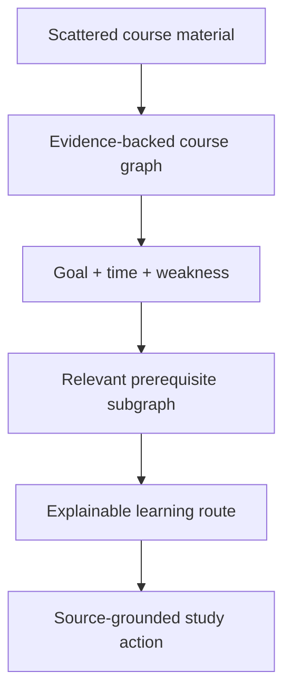

Everything else is subordinate.

If a feature does not improve source ingestion, graph correctness, route quality, trust, or the clarity of that transformation, it is not an MVP feature. The winning version of graphite is not the version with the most integrations or generated content. It is the version that takes a student from “I have too much material and do not know where to start” to a defensible first action in under two minutes.
