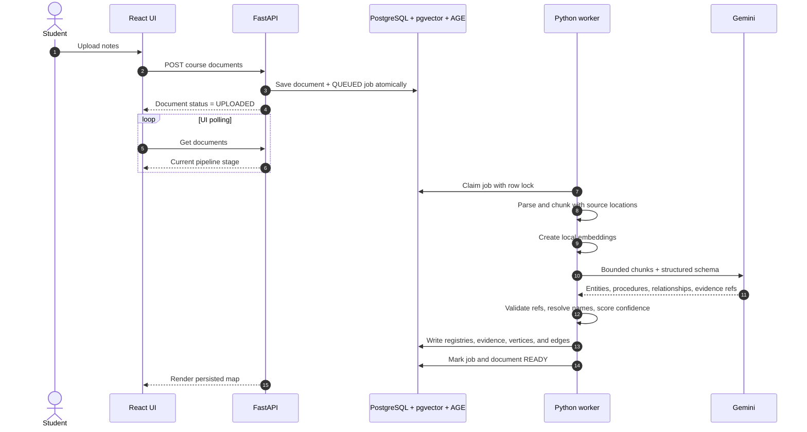

# graphite — Hackathon Design Story

> **Pitch:** Upload the materials your class actually gave you. Tell graphite what you need to learn and how much time you have. It maps the subject, finds the prerequisites, and builds the shortest sensible route—with evidence for every turn.
>
> **Category:** Work & Productivity  
> **Audience:** Hackathon teammates, architecture-diagram owner, slide designer, demo presenter  
> **Architecture source:** [`hackathon-architecture.mmd`](./hackathon-architecture.mmd)  
> **Implementation status:** Working MVP architecture, with optional voice features dependent on provider configuration

## 1. The story in one minute

Students do not usually fail to study because they have no material. They fail because the material arrives as a pile: lecture PDFs, copied notes, study guides, and recordings. When the exam is tomorrow and there are only 60 minutes left, the first problem is not answering a question. It is deciding **where to begin**.

Most AI study tools make more content. graphite makes a route.

graphite reads the student's own material and turns it into an evidence-backed knowledge graph: concepts, skills, procedures, steps, examples, and the relationships between them. The student gives it a destination, a time budget, and an honest weakness. graphite searches for the relevant part of the map, walks backward through prerequisites, resolves conflicting paths, and produces a time-boxed study sequence.

The reveal for the demo is:

> “Do not start with the topic you searched for. Start here—because these two concepts depend on it, your notes support that dependency, and this route fits the time you actually have.”

That is the product's “Google Maps for learning” moment. The graph is not decoration and the model is not silently improvising a syllabus. The route is computed from source-backed structure.

## 2. The problem, tension, and payoff

### The problem

A student with an imminent exam has abundant information but scarce attention. Their work is fragmented across files and formats. Before learning anything, they must manually answer:

- What is in scope?
- Which ideas depend on which others?
- What am I weakest at?
- What can fit into the remaining time?
- Can I trust a generated explanation to reflect my class?

Chat interfaces reduce search time, but they still make the student invent the right questions. Static study-guide generators flatten the material into prose and hide why one topic should come before another.

### The tension

An LLM can recognize meaning, but asking it to invent the entire plan creates an unstable black box. A pure graph algorithm is explainable, but it cannot read a messy PDF. graphite deliberately splits those responsibilities:

- AI interprets unstructured material and creates structured candidates.
- Evidence links every important candidate back to the original source.
- Graph traversal establishes dependencies.
- Deterministic code decides order, priority, cycle handling, and time allocation.
- AI returns only to explain or transform the already-grounded route into study materials.

### The payoff

The student moves from “I have a pile of notes and one hour” to “I have a 55-minute route, I know why it starts here, and every step opens into the exact source evidence, flashcards, questions, or narration I need.”

## 3. Product promise

graphite is a local-first course intelligence layer that turns scattered material into an executable plan.

The product makes four promises:

1. **It uses the student's course, not the open internet.** Source files, extracted text, vectors, graph records, plans, and progress live locally. Only bounded requests for interpretation, OCR, or voice leave the machine.
2. **It shows its work.** Entities, relationships, route steps, and generated study materials retain citations to source chunks.
3. **The graph drives the route.** A model can identify or explain relationships; it cannot arbitrarily reorder the final plan.
4. **The deadline is real.** graphite reports what fits and what it omitted instead of pretending the entire course can fit into the user's time budget.

## 4. The demo journey

Use one cohesive before-and-after story rather than touring every screen.

### Act I — The pile

The student creates an “AWS Solutions Architect Professional” workspace and drops in `AWS.txt` (or a small set of course notes). The Sources screen shows the real processing stages:

`UPLOADED → PARSING → CHUNKING → EMBEDDING → EXTRACTING → RESOLVING → READY`

Narration: “The student does not organize or tag anything. graphite preserves where each idea came from while it converts the material into a course model.”

### Act II — The map appears

Open the Map screen. Show real entities such as services, design concepts, or procedures and their typed relationships. Click a node or edge to reveal confidence and source evidence.

Narration: “This is not a decorative network generated for the UI. The topology is persisted and queryable. Every visible relationship can point back to the notes that justified it.”

### Act III — Set a destination

Enter a concrete goal such as:

> “Prepare me to choose resilient AWS architectures. I have 60 minutes and I am weak on VPC networking.”

The planner embeds the goal, selects relevant entities, expands their prerequisite neighborhood, converts semantic dependencies into study order, breaks any cycle by setting aside its least-confident edge for this route, ranks eligible concepts, and fits them to 60 minutes.

Narration: “Gemini helped read the map. It did not choose the route. The route comes from deterministic graph and scheduling logic, so the system can explain every turn.”

### Act IV — Learn, do not plan

Scroll through the ordered route. Each step has a time box, activity type, inclusion reason, citations, and completion state. Open a step in Materials, Flashcards, or Practice. Optionally generate and play a narrated recap.

Narration: “The same evidence that justified the route now powers the learning experience. The student starts useful work immediately.”

### Final line

> graphite turns “What should I study?” from a prompt into a computable, inspectable route.

## 5. System architecture

The presentation-ready system diagram lives in [`hackathon-architecture.mmd`](./hackathon-architecture.mmd). Its left-to-right reading order is also the product story:

```text
student intent → source ingestion → knowledge graph → deterministic route → grounded study
```

### Architecture at a glance

| Layer | What it contains | Why it exists |
| --- | --- | --- |
| Student experience | React 19, TypeScript, Vite, course/source/map/route/study screens | Makes ingestion progress, graph evidence, the computed route, and study modes visible |
| Application API | FastAPI routes for courses, documents, jobs, graph, sessions, artifacts, audio | Keeps clients simple and holds provider keys behind the server boundary |
| Background pipeline | Python worker, parser, OCR, chunker, embedder, extractor, resolver | Turns slow and failure-prone ingestion into a durable, observable job |
| Planning engine | Hybrid retrieval, graph expansion, cycle handling, priority scoring, topological ordering, time fitting | Produces a repeatable route instead of an unconstrained model answer |
| Data system | PostgreSQL relational tables + pgvector + Apache AGE | Stores application state, semantic similarity, and graph topology in one transactional system |
| Model boundary | Gemini through one internal adapter | Performs structured extraction, optional OCR, and grounded artifact generation with bounded retries |
| Voice boundary | ElevenLabs speech-to-text and text-to-speech | Lets a recording become source material and lets a study step become narration |

## 6. Why the database has three personalities

One PostgreSQL instance answers three different classes of question:

| Storage mode | Question it answers | Canonical data |
| --- | --- | --- |
| Relational SQL | “What is this, where did it come from, and what state is it in?” | Courses, documents, chunks, entity registry, relationship registry, evidence, jobs, study sessions, steps, artifacts |
| pgvector | “Which stored ideas or excerpts are semantically closest to this goal?” | 384-dimensional local embeddings on chunks and entities |
| Apache AGE | “How are these ideas connected, and which paths lead to the goal?” | Vertices and typed edges for the course topology |

Relational records and AGE elements share application-generated UUIDs. This keeps identity, evidence, confidence, and workflow state under normal SQL constraints while AGE focuses on traversal. The graph repository is the only module that issues Cypher and reconciles the two views.

This is a strong architecture-slide message: **one database process, three specialized ways to ask questions, no synchronization service between separate databases.**

## 7. Ingestion: from files to a trustworthy map



### Important implementation details

- Supported document inputs are PDF, DOCX, TXT, and Markdown.
- OCR is explicit because scanned pages require sending images to Gemini; text extraction and local embedding do not.
- Chunks retain page and section context, so evidence remains useful in the interface.
- The worker claims queued work with `FOR UPDATE SKIP LOCKED`, retries abandoned jobs, and exposes honest stage changes to the UI.
- Extraction uses structured response schemas, accepts only known relationship types and entity endpoints, resolves chunk references against the supplied batch, and bounds stored excerpts before writing.
- Procedures become a parent entity plus independently addressable `PROCEDURE_STEP` nodes connected by `HAS_STEP` and `NEXT` edges.
- Low-confidence model relationships are marked for review rather than silently promoted to fact.
- A failed extraction preserves parsed chunks and embeddings; the user can retry extraction without repeating the earlier work.

## 8. Planning: from a map to a route

```mermaid
flowchart LR
    Goal["Goal + minutes + weakness"] --> Retrieve["Hybrid relevance<br/>entity vector + chunk vector + lexical match"]
    Retrieve --> Seeds["Goal-relevant entities"]
    Seeds --> Traverse["AGE traversal<br/>prerequisites + procedure order"]
    Traverse --> DAG["Planning DAG<br/>reverse REQUIRES direction"]
    DAG --> Cycles["Detect cycles<br/>set aside weakest edge"]
    Cycles --> Rank["Rank eligible nodes<br/>relevance + weakness + downstream value"]
    Rank --> Order["Topological order<br/>keep procedure steps together"]
    Order --> Budget["Fit time budget<br/>shorten, then omit with reasons"]
    Budget --> Route["Persisted route<br/>steps + time + rationale + citations"]
```



The distinction between semantic direction and study direction is useful on a technical slide:

```text
Semantic fact:     Advanced Topic --REQUIRES--> Foundation
Study direction:  Foundation ------before----> Advanced Topic
```

The planner's priority score combines goal relevance, an explicit weakness match, downstream dependency value, source-derived importance, and uncertainty. Graph precedence still constrains what may come next. Priority only chooses among currently valid options.

When the route exceeds the budget, graphite first converts lower-priority learning steps to shorter reviews, then removes low-value leaf topics, then compresses remaining durations. It preserves requested goal material as long as possible and records every omission. The invariant is simple: allocated time never exceeds available time.

## 9. Grounded study modes

Once a route exists, each persisted step becomes a reusable context boundary:

- **Materials:** a concise summary, learning objective, key points, and common confusions.
- **Flashcards:** question/answer pairs with citation labels.
- **Practice:** multiple-choice questions, correct answers, and grounded explanations.
- **Audio:** an ElevenLabs narration derived from the step summary.
- **Progress:** TODO, ACTIVE, COMPLETE, or SKIPPED status stored against the route.

Artifacts are generated from the step's stored evidence, not from a broad course-wide prompt. Generated content and citations are cached as `study_artifacts`, which makes repeated navigation fast and preserves what the student actually studied.

## 10. Trust, privacy, and failure behavior

Trust is part of the feature, not a disclaimer beneath it.

| Risk | Product response |
| --- | --- |
| Hallucinated course fact | Prompts prohibit outside knowledge; outputs require valid source evidence; generated study material is built from persisted citations |
| Invented dependency | Relationships carry rationale, confidence, review state, and chunk evidence |
| Circular prerequisites | Planner detects cycles and excludes the lowest-confidence edge only for route ordering; the original edge remains visible |
| Impossible schedule | Planner omits or compresses steps and says what did not fit |
| Provider outage or quota | Jobs expose failure, retain completed stages, and allow an extraction-only retry |
| Duplicate upload | SHA-256 uniqueness within a course rejects identical content |
| Secret exposure | Gemini and ElevenLabs credentials stay server-side and raw provider errors are not returned to the browser |
| Privacy ambiguity | Storage and embedding are local; UI language should disclose when selected text, page images, or audio are sent to external providers |

## 11. What is implemented now

This document describes the repository at the current MVP boundary, not a hypothetical production platform.

### Working path

- Course creation and navigation
- Multi-file upload and duplicate detection
- PDF, DOCX, TXT, and Markdown parsing
- Optional PDF OCR
- Background job polling and visible ingestion stages
- Local FastEmbed embeddings using `BAAI/bge-small-en-v1.5`
- Gemini structured entity and relationship extraction
- Canonical concepts, skills, formulas, procedures, procedure steps, and examples
- Typed edges and source evidence in relational storage plus Apache AGE
- Interactive custom React/SVG knowledge-map view
- Deterministic, time-bounded study-session planning
- Persisted route steps and completion state
- Grounded summaries, flashcards, and practice questions
- ElevenLabs narration and audio transcription endpoints/UI when credentials are configured

### Honest MVP constraints

- Single-user and local-first; there is no authentication or collaboration model.
- The worker is a separate process and currently handles one claimed job at a time.
- Entity resolution is intentionally lightweight and primarily name/type based; it is not a general ontology merger.
- Extraction quality depends on source quality and Gemini availability.
- The graph view is a custom frontend visualization, not a full graph editor.
- There is no internet enrichment, LMS/Drive/Notion connector, cloud deployment, or institutional administration.
- Rerouting is triggered by creating a new goal/session; automated mastery-based rerouting is future work.

## 12. Design language for the diagram and deck

The UI uses a playful retro-adventure metaphor. Treat that as narrative scaffolding, not decoration:

- **The course is a world.** Source material reveals the terrain.
- **Concepts are locations.** Their edges are roads, dependencies, or sequences.
- **The goal is a destination.** A weakness is the student's current obstacle.
- **The route is the product.** Time is the constraint that makes route choice meaningful.
- **Evidence is the road sign.** It explains why the route is trustworthy.
- **Study modes are actions at each stop.** Learn, review, practice, and listen.

For the final architecture graphic, keep a strong left-to-right journey and visually distinguish:

- blue for the student-facing experience;
- green for the knowledge pipeline;
- purple for API and planning logic;
- warm orange for the unified data layer; and
- neutral gray with dashed borders for external providers.

Do not make Gemini the largest object on the slide. The differentiated system is the evidence-backed graph and route planner; the model is an enabling component.

## 13. Suggested slide narrative

### Slide 1 — The pile is not a plan

Visual: messy PDFs, notes, and a recording on the left; an exam countdown on the right.  
Message: students lose scarce study time deciding how to study.

### Slide 2 — graphite draws the map

Visual: source pile transforms into a cited concept graph.  
Message: graphite converts the student's real course material into durable structure.

### Slide 3 — Set a destination, not a prompt

Visual: goal + “60 minutes” + weakness flows into a highlighted subgraph.  
Message: the product understands intent and constraints, not just keywords.

### Slide 4 — The graph chooses the route

Visual: simplify the planning diagram from section 8.  
Message: semantic retrieval finds the neighborhood; graph logic and deterministic scheduling establish the order.

### Slide 5 — Every turn has a reason

Visual: one route step with its time box, “why now” rationale, and source excerpt.  
Message: evidence and visible uncertainty turn AI output into something the student can trust.

### Slide 6 — One route, four ways to learn

Visual: route step branching to summary, flashcards, practice, and narration.  
Message: generation is downstream of planning and grounded in the same evidence.

### Slide 7 — Architecture

Visual: restyle/export `hackathon-architecture.mmd`.  
Message: local-first data, one multi-model PostgreSQL system, bounded external AI, and an explainable planning core.

### Slide 8 — The memorable outcome

Visual: “Do not start with X. Start with Y.” beside the highlighted prerequisite path.  
Message: graphite gives students back the time and confidence normally lost before studying begins.

## 14. Presenter cheat sheet

### 15-second version

“graphite turns a student's scattered notes into an evidence-backed knowledge graph, then computes a goal-specific route that fits the time they actually have. Unlike a chatbot, it can show why every topic is included, why it comes next, and where that claim appears in the course material.”

### Technical judge version

“We use local embeddings and hybrid retrieval to identify goal-relevant entities, Apache AGE to expand prerequisite topology, and deterministic Python to resolve cycles, topologically order the subgraph, and fit the result to a time budget. Relational PostgreSQL holds identity, provenance, workflow state, and generated artifacts; stable UUIDs bridge those records to AGE. Gemini handles structured interpretation and grounded generation, but it never owns the final study order.”

### Why not just RAG?

“RAG finds passages that may answer a question. graphite persists a model of the course and uses that model to decide which prerequisites must come first. Retrieval locates the destination; graph structure computes the route.”

### Why does the graph matter?

“Remove the graph and the product loses prerequisite expansion, inspectable dependencies, cycle detection, and deterministic ordering. It would collapse into a study-guide prompt. The route is a real graph-derived product behavior.”

### Why local-first?

“Course files, chunks, embeddings, graph state, plans, and progress remain on the student's machine. External calls are bounded to tasks that need them, and the interface can be explicit about what leaves the device.”

## 15. North-star framing

Today, graphite plans a study session from course files. The broader idea is a personal navigation layer for learning: a durable map that can accept a new destination, account for the learner's constraints, and reroute without losing provenance.

For the hackathon, resist selling the distant platform. Win the concrete story:

> A stressed student arrives with messy notes and 60 minutes. graphite returns an evidence-backed route and gets them studying.
